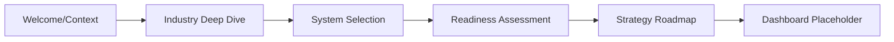
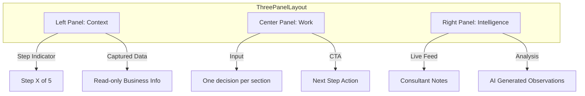
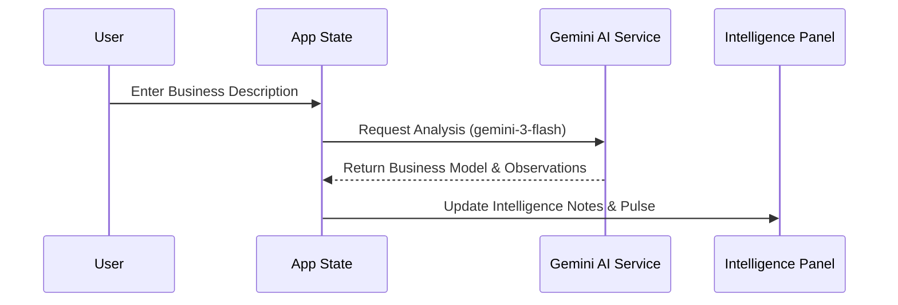

# Sun AI Agency — Technical Overview

This document provides a high-level technical map of the Sun AI Agency premium consulting platform.

## 1. Tech Stack Versions

The application utilizes a modern, lightweight frontend stack focused on performance and AI integration.

| Technology | Version | Source |
| :--- | :--- | :--- |
| **React** | `19.2.3` | esm.sh |
| **@google/genai** | `1.34.0` | esm.sh |
| **Tailwind CSS** | Latest (Play CDN) | cdn.tailwindcss.com |
| **TypeScript** | Standard | Internal |
| **Google Fonts** | Inter, Playfair Display, Lora | fonts.googleapis.com |

---

## 2. Directory Structure

The project follows a flattened "root-as-src" structure to ensure modularity and clarity.

```text
/
├── components/
│   ├── ThreePanelLayout.tsx   # Core UI Shell (Left/Center/Right)
│   └── WizardSteps.tsx        # Individual logic for Steps 1–5
├── docs/
│   └── 01-overview.md         # Technical documentation
├── services/
│   └── geminiService.ts       # Google GenAI API integration logic
├── App.tsx                    # Main state orchestrator & "Router"
├── index.html                 # Entry point & Import Maps
├── index.tsx                  # React mounting
├── style-guide.md             # UI/UX specification
└── types.ts                   # Shared interfaces
```

---

## 3. Sitemap & Routing

### Navigation Model
The application currently uses **State-Based Navigation** rather than a traditional URL-based router. This ensures a focused, wizard-driven user experience where progress is strictly linear.



### Route/Step Mapping
1. `step === 1`: Business Context (Identification)
2. `step === 2`: Industry Deep Dive (Problem definition)
3. `step === 3`: System Selection (Solution architecture)
4. `step === 4`: Readiness Assessment (Risk & Gap analysis)
5. `step === 5`: Strategy & Next Steps (Execution plan)
6. `step === 6`: Client Dashboard (Execution Hub)

---

## 4. UI Architecture (The 3-Panel Layout)

All wizard screens adhere to a strict three-column intelligence system.



---

## 5. Workflows (Data & AI)

The core value proposition is the real-time synthesis of AI intelligence as the user provides data.

### AI Integration Flow


---

## 6. Current Feature List

### Wizard Modules
- **Context Awareness:** Detects industry and business model automatically.
- **Dynamic Questioning:** Generates industry-specific options (e.g., "Real Estate" vs "Fashion") using AI.
- **System Recommendation:** Maps problem blockers to architectural systems (Growth, Ops, Support).
- **Readiness Scoring:** Real-time evaluation of data maturity and execution risk.
- **Roadmap Generation:** Synthesizes a 90-day phase-based execution plan.

### Dashboard (Placeholder)
- **Systems Hub:** List of active/pending AI systems.
- **Timeline Overview:** 48-hour start countdown.
- **Recommendation Feed:** High-level strategic advice based on wizard data.

---

## 7. Import Paths & Setup
- **External Dependencies:** Managed via standard ESM import maps in `index.html`.
- **Internal Imports:** Relative paths (`./components/...`, `./services/...`).
- **React Router:** Not currently implemented; state-based transition is used for the wizard flow to maintain context integrity.