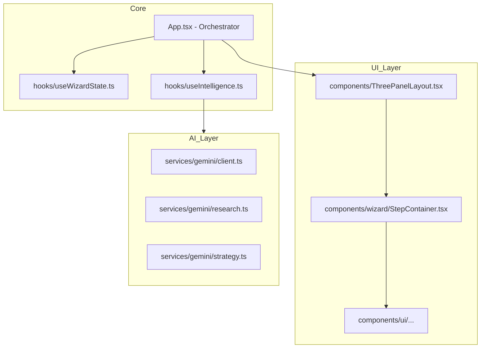
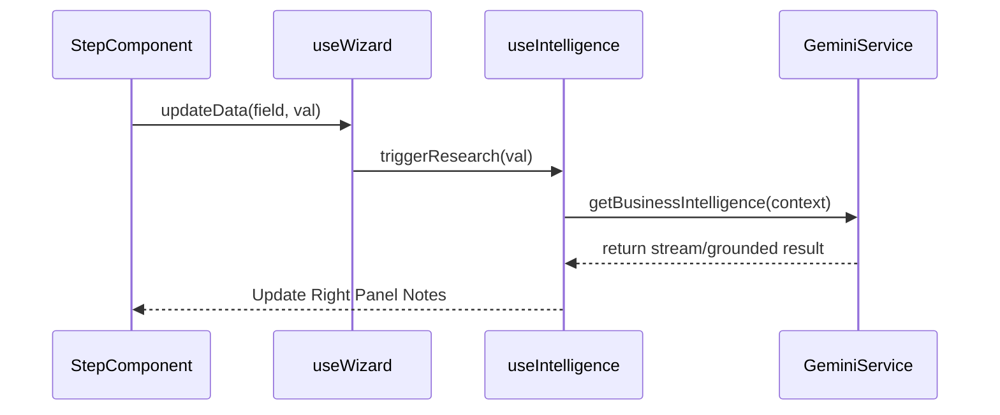

# Refactor Plan: Modular Architecture — Sun AI Agency

## 1. Architectural Overview
The goal is to move from a "Single File per Layer" approach to a "Feature-Based Module" approach. This makes the codebase easier to audit for correctness and allows for parallel development of advanced AI features.

### System Architecture (Proposed)



## 2. Proposed Directory Structure

```text
/
├── components/
│   ├── layout/
│   │   └── ThreePanelLayout.tsx
│   ├── wizard/
│   │   ├── Step1Context.tsx
│   │   ├── Step2Diagnostics.tsx
│   │   ├── Step3Systems.tsx
│   │   ├── Step4Readiness.tsx
│   │   └── Step5Roadmap.tsx
│   └── ui/
│       ├── RadarChart.tsx
│       ├── ProgressBar.tsx
│       └── SkeletonLoading.tsx
├── hooks/
│   ├── useWizard.ts        # Logic for state & persistence
│   └── useIntelligence.ts  # Logic for AI streaming & orchestration
├── services/
│   └── gemini/
│       ├── client.ts       # Shared AI initialization
│       ├── discovery.ts    # getBusinessIntelligence, getIndustrySpecificQuestions
│       └── strategy.ts     # getSystemRecommendations, getReadinessAssessment, getRoadmap
├── App.tsx                 # Clean entry point
├── types.ts                # Shared interfaces
└── index.tsx               # Entry
```

## 3. Data Flow & Intelligence Loop

The "Consultant Persona" requires a synchronized data flow. The refactor ensures that inputs in the **Center Panel** trigger the **Intelligence Hook** without cluttering the UI component logic.



## 4. Implementation Steps (Phased)

### Phase 1: Shared UI & Types
- Extract `RadarChart` and `SkeletonLoader` to `components/ui/`.
- Ensure `types.ts` covers all multi-dimensional readiness scores.

### Phase 2: Service Decoupling
- Split `geminiService.ts` into domain files.
- Ensure `googleSearch` and `thinkingConfig` are strictly applied in their respective modules.

### Phase 3: Custom Hooks Extraction
- Move `localStorage` logic into `useWizard`.
- Move streaming and intelligence state management into `useIntelligence`.

### Phase 4: Component Migration
- Move each step from `WizardSteps.tsx` to individual files.
- Update `App.tsx` to use the new modular components.

## 5. Verification Strategy
- **State Integrity**: Verify `localStorage` rehydration works after refactor.
- **AI Correctness**: Confirm `googleSearch` citations still render in the right panel.
- **Visual Regression**: Ensure no layout shifts or style variations occur.
- **Performance**: Monitor `App.tsx` render count during input streaming.
```