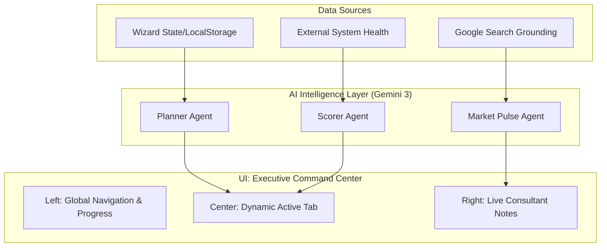

# 05: Client Dashboard — Executive Command Center

**Status:** 🔴 Planning Phase  
**Priority:** P0 — Critical Engagement Layer  
**Persona:** Senior Executive / Founder  

---

## 🟢 Progress Tracker
- [ ] Foundational 3-Panel Shell
- [ ] Real-time Intelligence Stream (Right Panel)
- [ ] Strategic Overview (Main Hub)
- [ ] Systems Health & Integration Status
- [ ] 90-Day Roadmap Visualization (Gantt-lite)
- [ ] Automated Task Generation from Strategy
- [ ] Performance & ROI Analytics

---

## 1. Purpose & Vision
The Client Dashboard transitions the user from **Discovery** (Wizard) to **Execution** (Hub). It is not a generic SaaS dashboard; it is an **Executive Command Center** designed to reduce cognitive load and increase operational velocity.

### Primary Goals
- **Maintain Strategic Alignment:** Constantly remind the user of their core "Friction Point" and "Growth Priority."
- **Visualize Velocity:** Show progress on the 90-day plan through high-fidelity visual markers.
- **Predictive Guidance:** Use AI to identify potential roadblocks before they impact revenue.

---

## 2. Gemini 3 Features & AI Agent Orchestration

The dashboard leverages **Gemini 3 Pro** as a suite of active agents rather than a passive chatbot.

### A. The Planner Agent
- **Logic:** Ingests the `roadmap` and `userData`.
- **Function:** Decomposes monthly outcomes into weekly executable tasks.
- **Workflow:** Updates task priority dynamically based on "Scale Score" from Step 4.

### B. The Market Pulse Agent (Search Grounding)
- **Tool:** `googleSearch`
- **Workflow:** Runs background queries on industry trends relevant to the user's sector.
- **Output:** Streams "Intelligence Alerts" in the right panel (e.g., "Competitor X just launched a similar AI-driven support feature. Recommended adjustment: [X]").

### C. The ROI Scorer (Thinking Mode)
- **Thinking Budget:** 4096 tokens.
- **Logic:** Analyzes completion rates and system health to project ROI.
- **Output:** Generates the "Operational Efficiency" metric on the Analytics tab.

---

## 3. Architecture & Data Flow

---

## 4. Multistep Implementation Prompts

### Prompt 1: The Three-Panel Shell
> Implement a persistent 3-panel layout consistent with the Sun AI Agency style guide. 
> - **Left:** Vertical navigation (Overview, Systems, Roadmap, Tasks, Analytics, Settings).
> - **Center:** Main workspace with a breadcrumb header showing "Active Strategy: [Priority Name]".
> - **Right:** The "Sun Intelligence" feed with a pulse indicator and streaming narrative.
> **Success:** Fluid transitions between tabs without re-rendering the right panel.

### Prompt 2: Overview & ROI Hub
> Create the "Overview" tab using a modular grid. 
> - **Top Row:** 4 High-impact metrics (Systems Deployed, Current Readiness, 90-Day Velocity %, Est. Time Saved).
> - **Mid Section:** "Strategic North Star" card displaying the primary priority from the wizard.
> - **Bottom Section:** Recent Activity Feed.
> **Success:** Displays wizard-derived data with a premium, minimalist aesthetic.

### Prompt 3: Roadmap & Task Decomposition
> Build the "Roadmap" tab featuring a vertical Gantt-lite visualization.
> - **Interaction:** Clicking a Phase expands it to show specific "Outcomes."
> - **Integration:** Link the "Planner Agent" to generate a dynamic task list for the current phase.
> - **Logic:** Tasks should be categorized by "Internal Team" vs "Sun AI Automation."
> **Success:** Transitions a text-based strategy into a clickable project plan.

---

## 5. Use Case Examples

| Industry | Dashboard Focus | AI Observation Type |
| :--- | :--- | :--- |
| **Luxury Fashion** | Inventory & SKU Velocity | "Supply chain friction detected in SKU intake; recommending automated SKU tagging." |
| **B2B SaaS** | Lead Response & Sales Funnel | "Lead response time is lagging competitors. Deploying 'Sales Orchestrator' is now P0." |
| **Real Estate** | Listing Throughput | "Local market trends suggest a shift to 3D-tour priority. Adjusting Phase 2 roadmap." |

---

## 6. Production-Ready Checklist

- [ ] **State Persistence:** LocalStorage/Supabase hook for all dashboard updates (tasks/notes).
- [ ] **Latency Management:** Use skeleton loaders for AI-generated task lists.
- [ ] **Accessibility:** Full keyboard navigation for executive speed-usage.
- [ ] **Responsive Design:** Mobile-view stacks panels; Right panel collapses to a floating bubble.
- [ ] **AI Reliability:** Fallback text for when Search Grounding fails or returns null.
- [ ] **Security:** "Executive Security Key" validation for sensitive strategy data.
