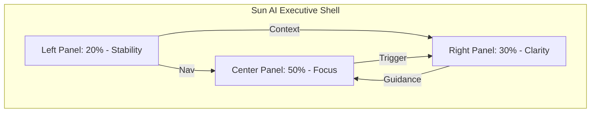
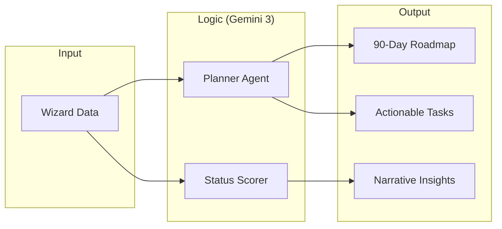

# 05.1: Client Dashboard — Core Setup

**Status:** 🟡 Documented & Ready for Build  
**Version:** 1.0 (Core Foundation)  
**Persona:** Senior Executive / Founder  
**Voice:** Premium · Editorial · Sophisticated

---

## 🟢 Implementation Progress
- [ ] **Prompt 0:** System Context & Persona Alignment
- [ ] **Prompt 1:** Executive Purpose Definition
- [ ] **Prompt 2:** Three-Panel Structural Foundation
- [ ] **Prompt 3:** Left Panel (Context & Global Nav)
- [ ] **Prompt 4:** Center Panel (Execution Hub Overview)
- [ ] **Prompt 5:** Roadmap View (Gantt-Lite Visualization)
- [ ] **Prompt 6:** Task Management (High-Velocity Action)
- [ ] **Prompt 7:** Right Panel (Narrative Intelligence)
- [ ] **Prompt 8:** Core AI Agent Workflows
- [ ] **Prompt 9:** v1 Success & Quality Assurance

---

## 1. Visual Architecture (Mermaid)

### A. The 3-Panel Interface

### B. Core Data Flow: Strategy to Execution

---

## 2. Multi-Step Implementation Prompts

### PROMPT 0 — SYSTEM CONTEXT
**Role:** Senior Product Designer & AI Systems Architect.  
**Objective:** Set the constraints for a luxury executive command center.  
**Constraint:** Eliminate "SaaS clutter." Use white space as a structural element. No hype language.

### PROMPT 1 — DASHBOARD PURPOSE
**Task:** Define why this exists for a busy founder.  
- **Visible at all times:** The primary "Friction Point" we are solving.  
- **Decision focus:** What needs a signature or an approval *right now*?  
- **Hidden:** Technical logs, server statuses, and complex configurations.

### PROMPT 2 — 3-PANEL LAYOUT FOUNDATION
**Task:** Map data to panels.
| Panel | Purpose | Core Contents | Logic |
| :--- | :--- | :--- | :--- |
| **Left** | Grounding | Brand Identity, Navigation, Global Progress | Static / Persistent |
| **Center** | Execution | Current Phase, Active Tasks, Roadmap | Interactive / Dynamic |
| **Right** | Intelligence | Narrative Guidance, "Why this matters", Risk Alerts | Streaming / Contextual |

### PROMPT 3 — LEFT PANEL (STABILITY)
**Task:** Design the sidebar.  
- **Identity:** `userData.companyName` in Serif typography.  
- **State:** Active Phase (e.g., "Phase 1: Foundation Building").  
- **Navigation:** Overview, Roadmap, Tasks, Systems, Settings.  

### PROMPT 4 — CENTER PANEL (OVERVIEW)
**Task:** Build the "Execution Hub."  
- **Hero Card:** "The Mission" — A one-sentence distillation of the 90-day goal.  
- **Weekly Focus:** 3 critical items generated by the Planner Agent.  
- **Progress:** A minimalist horizontal track showing % of current phase complete.

### PROMPT 5 — ROADMAP VIEW (GANTT-LITE)
**Task:** Visualize the 90-day strategy.  
- **Design:** Vertical timeline with Phase headers.  
- **Interaction:** Expanding a phase reveals "Strategic Outcomes."  
- **Clarity:** Current week is highlighted with an amber glow.

### PROMPT 6 — TASKS VIEW (ACTIONABLE ONLY)
**Task:** Implement the task grid.  
- **Categorization:** "Client Input Required" vs. "Sun AI Automating."  
- **Detail:** Each task has a "Business Impact" line (e.g., "Clears 4 hours of weekly admin").  

### PROMPT 7 — RIGHT PANEL (NARRATIVE INTELLIGENCE)
**Task:** Design the consultant's feed.  
- **Style:** Lora (Serif) font, `leading-relaxed`.  
- **Persona:** Professional, editorial, human-like.  
- **Example:** "We've initiated the data cleanup. This will feel slow for 48 hours, but it's the prerequisite for the speed we need in Month 2."

### PROMPT 8 — CORE AI WORKFLOWS
**Task:** Define the backend logic.  
- **Planner Agent:** Triggered when `selectedSystems` or `roadmap` is updated. Decomposes outcomes into tasks.  
- **Risk Scorer:** Monitors task completion velocity and flags potential delays in plain language.

### PROMPT 9 — SUCCESS CRITERIA
**Task:** Quality Audit.  
- ** immediate Clarity:** Can a founder see their status in < 10 seconds?  
- **Outcome focused:** Does every UI element relate to a business goal?  
- **Premium Feel:** Does it look like a high-end agency report?

---

## 3. Core Constraints Checklist
- [ ] No dashboard "widgets" (clocks, weather, generic news).
- [ ] No "Marketing" or "Growth Hype" terms.
- [ ] Maximum 5 active tasks visible at one time.
- [ ] All AI responses must start with a direct observation, not a generic greeting.
