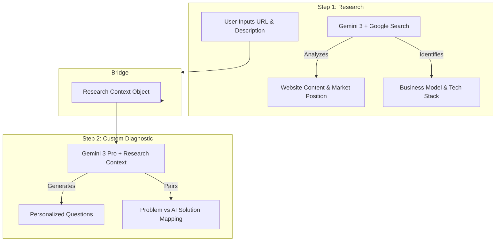

# 07: Wizard Intelligence — Industry Customization (Screen 1 & 2)

**Status:** 🟡 Implementation Ready  
**Focus:** Search Grounding · Website Analysis · Personalized Diagnostics  
**AI Agent:** The Researcher & The Diagnostic Partner

---

## 🟢 Strategic Vision
The transition from Screen 1 to Screen 2 is the "Aha!" moment for the executive. By researching the company's real-world presence in Screen 1, Screen 2 moves from generic "industry templates" to "bespoke operational audits."

---

## 1. Intelligence Flow (Mermaid)

### A. Context Extraction & Mapping

---

## 2. Implementation Prompts

### PROMPT 1: Enhanced Research Logic
**Objective:** Update `getBusinessIntelligence` to use `googleSearch` for deeper website analysis.
- **Task:** Modify the prompt to specifically instruct the AI to visit the provided `website` URL.
- **Extraction:** Identify specific service offerings and current manual "friction indicators" (e.g., lack of online booking, generic contact forms).
- **Output:** Return a `detectedModel` and `marketPosition` alongside existing notes.

### PROMPT 2: Contextual Diagnostic Generation
**Objective:** Update `getIndustrySpecificQuestions` to accept Screen 1 context.
- **Task:** Update the function signature to accept `researchContext: string`.
- **Response Schema:** Add arrays for `salesAIFeaturesOptions`, `manualWorkAIFeaturesOptions`, and `priorityAIFeaturesOptions`.
- **Constraint:** Every "Business Problem" option must have a corresponding "AI Solution" option in the new schema.

### PROMPT 3: Premium UI Pairing
**Objective:** Update `Step2Diagnostics.tsx` to display the Problem/Solution pairing.
- **Design:** When a user selects a "Problem" card, the "AI Solution" should appear in a subtle, amber-tinted sub-card with a "Proposed Engine" label.
- **Style:** Use Lora (Serif) for the AI Solution text to maintain the "Editorial" feel.

---

## 3. Success Criteria & QA

### Production Ready Checklist
- [ ] **Data Integrity:** Screen 2 questions accurately reflect the business model identified in Screen 1.
- [ ] **Search Reliability:** Citations in the Right Panel link directly to the user's actual website or industry news.
- [ ] **Visual Polish:** Pairing between problem and AI solution is clear but non-intrusive.
- [ ] **Performance:** Research completes in < 5 seconds using `gemini-3-flash-preview`.

### Success Metrics
- **Executive Relevance:** > 90% of generated questions use terminology specific to the company's niche.
- **Educational Value:** The user understands *which* AI tool solves their *specific* problem before reaching Screen 3.

---

## 4. Gemini 3 Tooling Audit
- **Tool 1:** `googleSearch` (Grounding context).
- **Feature 1:** `responseSchema` (Enforcing the Problem-Solution pairing).
- **Feature 2:** `thinkingBudget` (Allocated for mapping complex industry dependencies in Step 2).