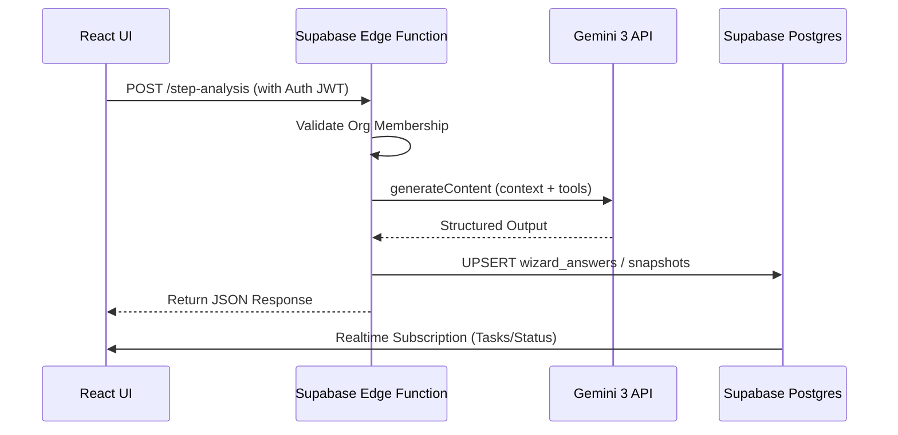
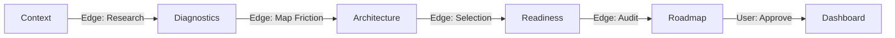
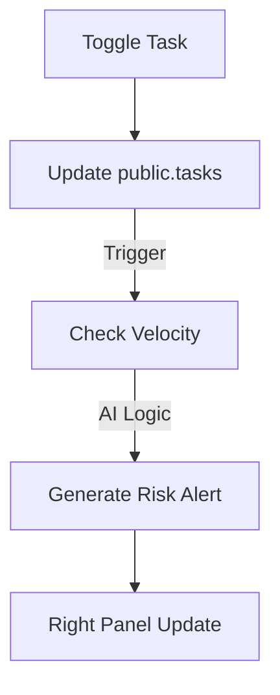

# Sun AI Agency — Frontend Wiring Plan

This document defines how the React application interacts with Supabase and Gemini 3 Edge Functions in a production environment.

---

## 1. Purpose of the Frontend Layer
The frontend acts as a **Thin Intelligence Shell**. Its primary responsibilities are:
- Capturing user intent (Wizard inputs).
- Visualizing complex AI outputs (Radar charts, roadmaps).
- Managing real-time intelligence streaming via Server-Sent Events (SSE).
- Enforcing multi-tenant navigation boundaries via JWT validation.

---

## 2. Page & Screen Map

### A. The Strategic Wizard (Steps 1–5)
- **S1: Context:** Identity & Grounding research. (Triggers `analyze-business`)
- **S2: Diagnostics:** Dynamic friction analysis. (Triggers `generate-diagnostics`)
- **S3: Architecture:** Modular system selection. (Triggers `recommend-systems`)
- **S4: Readiness:** Operational risk audit. (Triggers `assess-readiness`)
- **S5: Roadmap:** Strategy finalization & Approval. (Triggers `generate-strategy`)

### B. The Executive Dashboard (Tabs)
- **Overview:** Central command & ROI metrics.
- **Roadmap:** Interactive timeline & Phase expansion.
- **Tasks:** Actionable item list with status toggles.
- **Systems:** Health monitoring for AI engines.
- **Settings:** Strategy reset & Key management.

---

## 3. State Ownership Rules

| State Type | Storage Location | Lifetime | Permission |
| :--- | :--- | :--- | :--- |
| **User Identity** | Supabase Auth (JWT) | Persistent | Read-only from UI |
| **Wizard Progress** | Supabase `wizard_sessions` | Session-based | Read/Write (via Edge) |
| **Draft Answers** | React State / `wizard_answers` | Transient | Read/Write |
| **Locked Strategy** | `context_snapshots` | Permanent | **Read-only** |
| **Task Status** | `tasks` | Persistent | Read/Write (UI) |
| **Intelligence Feed** | React State (Local) | Volatile | UI Only |

---

## 4. Data Flow Architecture

---

## 5. 3-Panel Layout Wiring

- **Left Panel (Stability):** 
  - Subscribes to the `active_project` context.
  - Displays read-only summaries of previously committed data to maintain grounding.
- **Center Panel (Focus):** 
  - Purely functional. Owns the current form or task list.
  - Triggers Edge Functions on `onSubmit` or `onBlur` for specific high-value fields.
- **Right Panel (Intelligence):** 
  - Listens to an `intelligence_stream` state.
  - Displays the "Consultant's Narrative" as it streams from the Edge Function via SSE or chunked fetches.

---

## 6. Streaming AI Handling

1. **Initialization:** UI sends request to `intelligence-stream` Edge Function.
2. **Buffer:** Edge Function initiates a `ReadableStream` from Gemini.
3. **Chunking:** Tokens are piped to the UI in real-time.
4. **UI Update:** A `useIntelligence` hook appends chunks to a local string, triggering a re-render for the narrative panel.
5. **Fallbacks:** If streaming fails, the UI falls back to the static `summary` stored in the latest snapshot.

---

## 7. Error & Fallback Strategy

- **API Failure:** Show a "Consultant Offline" message in the right panel with a "Reconnect" button.
- **Partial JSON:** Edge Functions validate JSON against a Zod schema before writing. If invalid, the UI reverts to the last known valid state from DB.
- **Tenant Breach:** If RLS blocks a request (e.g., trying to access another org), the UI forces an immediate session termination.
- **Loading UI:** Use **Skeleton Loaders** to maintain layout stability during AI generation.

---

## 8. Security & UX Guardrails

- **No Local API Keys:** All Gemini calls must be proxied through Edge Functions.
- **Strict Write Control:** The UI never writes directly to `roadmaps`. It only writes to `wizard_answers` and `tasks.status`.
- **Tenant Validation:** Every frontend request includes the Org ID in the header, verified against the JWT on the server.

---

## 9. Flow Diagrams

### Wizard flow

### Task Synchronization

