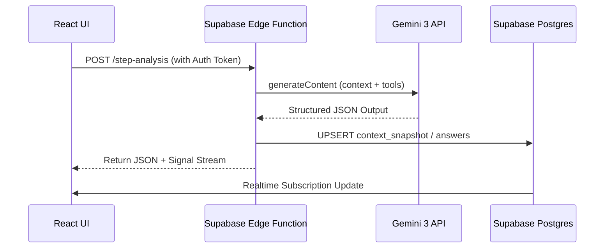
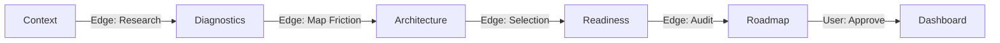
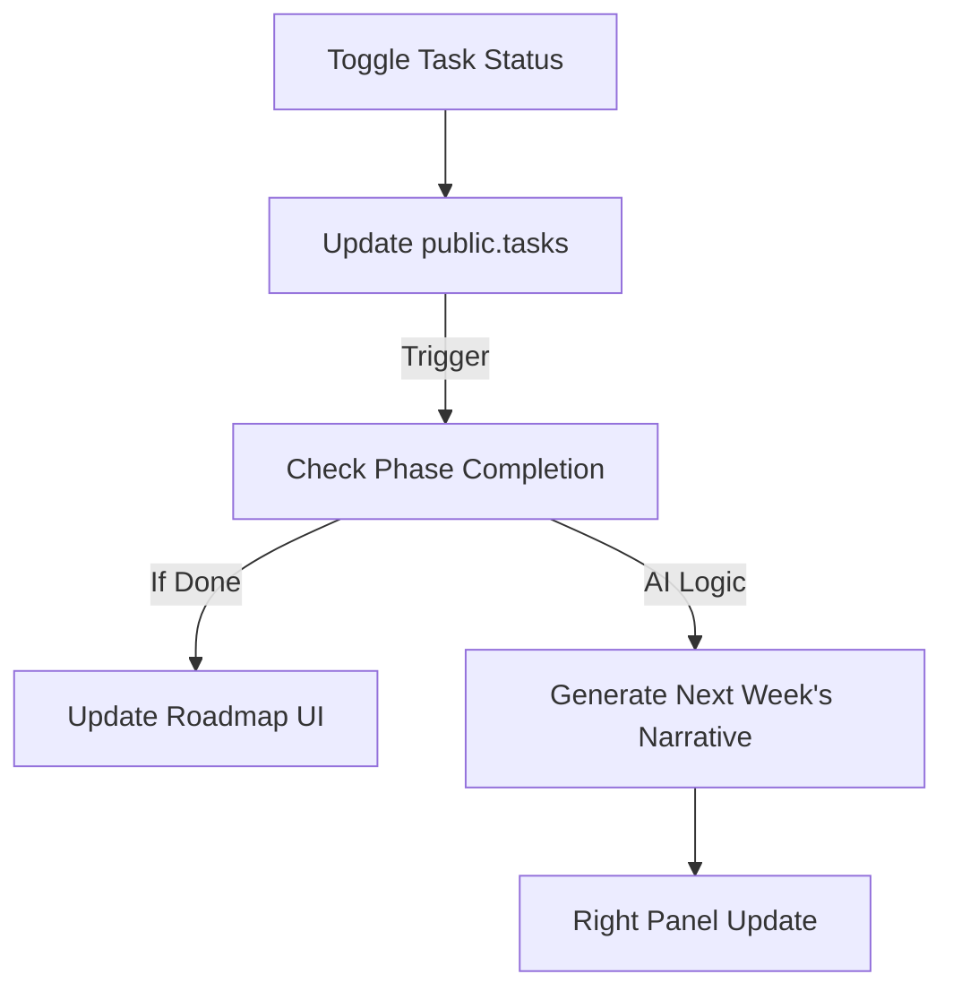

# Sun AI Agency — Frontend Wiring Plan

This document defines how the React application interacts with Supabase and Gemini 3 Edge Functions. It ensures a high-velocity, secure, and state-consistent user experience.

---

## 1. Purpose of the Frontend Layer
The frontend acts as a **Thin Intelligence Shell**. Its primary responsibilities are:
- Capturing user intent (Wizard inputs).
- Visualizing complex AI outputs (Radar charts, roadmaps).
- Managing real-time intelligence streaming.
- Enforcing multi-tenant navigation boundaries.

---

## 2. Page & Screen Map

### A. The Strategic Wizard (Steps 1–5)
- **S1: Context:** Identity & Grounding research.
- **S2: Diagnostics:** Dynamic friction analysis.
- **S3: Architecture:** Modular system selection.
- **S4: Readiness:** Operational risk audit.
- **S5: Roadmap:** Strategy finalization & Approval.

### B. The Executive Dashboard (Tabs)
- **Overview:** Central command & ROI metrics.
- **Roadmap:** Interactive timeline & Phase expansion.
- **Tasks:** Actionable item list with status toggles.
- **Systems:** Health monitoring for AI engines.
- **Settings:** Strategy reset & Key management.

---

## 3. State Ownership Rules

| State Type | Storage Location | Lifetime | Permission |
| :--- | :--- | :--- | :--- |
| **User Identity** | Supabase Auth | Persistent | Read-only from UI |
| **Wizard Progress** | LocalStorage -> DB | Session-based | Read/Write (UI) |
| **Draft Answers** | React State | Volatile | Read/Write (UI) |
| **Strategy Snapshots** | Supabase Table | Permanent (Locked) | Read-only after S5 |
| **Task Status** | Supabase Table | Persistent | Read/Write (UI) |
| **Intelligence Feed** | React State (Ref) | Volatile | UI Only |

---

## 4. Data Flow Architecture

---

## 5. 3-Panel Layout Wiring

- **Left Panel (Stability):** 
  - Subscribes to `wizard_session` or `active_project` state.
  - Displays read-only summaries of previous steps to maintain grounding.
- **Center Panel (Action):** 
  - Purely functional. Owns the current form or execution list.
  - Triggers Edge Functions on `onBlur` or `onClick`.
- **Right Panel (Intelligence):** 
  - Listens to a dedicated `stream` state.
  - Displays the "Consultant's Narrative" as it arrives from the Edge Function.

---

## 6. Streaming AI Handling

1. **Initialization:** UI sends request to Edge Function.
2. **Buffer:** Edge Function initiates a `ReadableStream`.
3. **Chunking:** As Gemini emits tokens, the Edge Function pipes them to the UI.
4. **UI Update:** A custom hook (`useIntelligenceStream`) appends chunks to a local string ref, triggering a re-render for the Lora-font narrative panel.
5. **Completion:** Status changes from `analyzing` to `complete`, showing a "Protocol Verified" badge.

---

## 7. Error & Fallback Strategy

- **API Failure:** Show a "Consultant Offline" message in the right panel with a retry button.
- **Partial JSON:** If an Edge Function returns malformed JSON, the UI reverts to the last known valid state from the database.
- **Tenant Breach:** If RLS blocks a request, the UI forces a logout/re-authentication.
- **Loading:** Use **Skeleton Loaders** instead of generic spinners to maintain the premium architectural feel.

---

## 8. Security & UX Guardrails

- **Key Isolation:** API Keys never touch the browser. All AI logic is proxied through Edge Functions.
- **Write Control:** The UI never writes directly to `roadmaps` or `snapshots`. It only writes to `wizard_answers` and `tasks`. Strategic outputs are written by the Edge Function after validation.
- **Tenant Validation:** Every frontend request includes the `JWT` which the Edge Function uses to verify the user belongs to the `org_id` they are trying to access.

---

## 9. Flow Diagrams

### Wizard Flow

### Dashboard Task Flow

