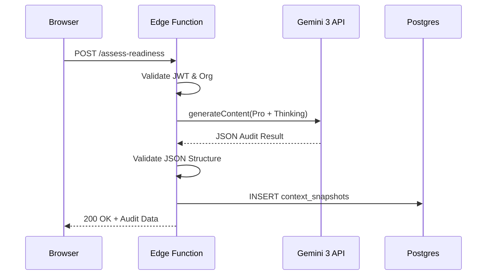
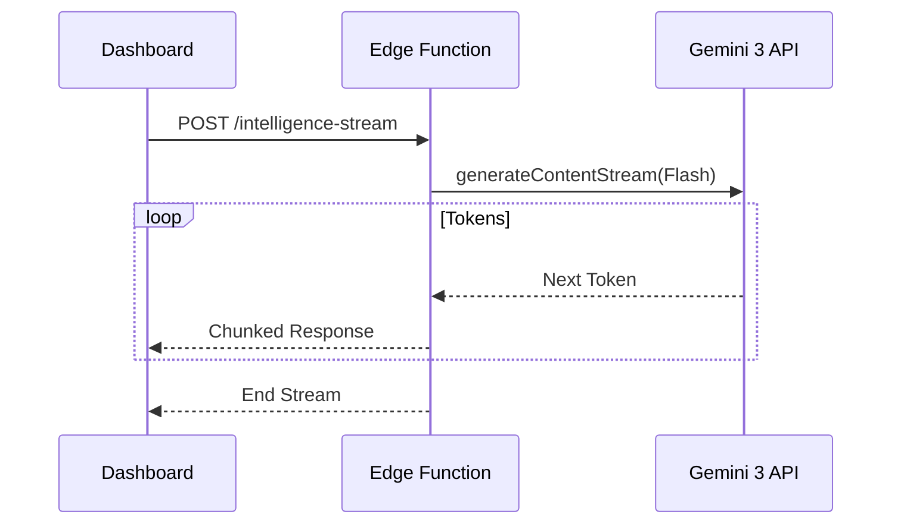

# Sun AI Agency — Supabase Edge Functions Strategy

This document defines the server-side intelligence layer. Edge Functions act as the "Security & Logic Gateway" between the Sun AI Agency UI and the Gemini 3 API.

---

## 1. Purpose of Edge Functions
Edge Functions are the **sole source of truth** for strategic logic. They ensure:
- **API Security:** Environment variables (Gemini Keys) are never exposed to the client.
- **Multi-Tenant Validation:** Membership is verified before any AI logic executes.
- **Structured Write Ownership:** Functions validate AI output before writing to the database.
- **Compute Efficiency:** Heavy reasoning and market search are offloaded from the client.

---

## 2. The "Secure Write" Rule
**Rule:** The Frontend Client (browser) is prohibited from writing to strategic tables (`context_snapshots`, `roadmaps`).
- **Logic:** The UI submits raw answers. The Edge Function processes these answers via Gemini, validates the result, and **the Edge Function performs the DB write** using a Service Role key.
- **Reason:** This prevents "hallucination injection" or manual tampering with readiness scores and strategic timelines.

---

## 3. List of Core Edge Functions

| Function Name | Wizard Step | AI Agent | Gemini Model |
| :--- | :--- | :--- | :--- |
| `analyze-business` | Step 1 | Researcher | Flash + Search |
| `generate-diagnostics` | Step 2 | Diagnostic Partner | Flash + Thinking (2k) |
| `recommend-systems` | Step 3 | Architect | Pro + Thinking (1k) |
| `assess-readiness` | Step 4 | Auditor | Pro + Thinking (4k) |
| `generate-strategy` | Step 5 | Strategist | Pro + Thinking (4k) |
| `task-generator` | Dashboard | Task Planner | Flash (Structured) |
| `intelligence-stream` | Global | Executive Partner | Flash (Streaming) |

---

## 4. AI Agent & Gemini Tool Mapping

### The Researcher (`analyze-business`)
- **Tools:** `googleSearch`.
- **Logic:** Verifies brand reputation and digital footprint. Extracts citations.
- **Persistence:** Writes to `wizard_answers`.

### The Auditor (`assess-readiness`)
- **Feature:** `thinkingConfig` (Target: 4k).
- **Logic:** Reasons through operational bottlenecks vs. scale capacity.
- **Persistence:** Writes structured JSON to `context_snapshots`.

### The Strategist (`generate-strategy`)
- **Feature:** `thinkingConfig` (Target: 4k) + Structured Outputs.
- **Logic:** Sequences 90-day plan phases for maximum ROI.
- **Persistence:** Writes to `roadmaps` and `roadmap_phases`.

---

## 5. Input / Output Contracts (Examples)

### Function: `assess-readiness`
- **Input:** `{ project_id: UUID, wizard_data: Object }`
- **Logic:** 
  1. Validate JWT (User belongs to Org).
  2. Call Gemini 3 Pro with Readiness Prompt.
  3. Validate JSON against Zod Schema.
- **Output:** `{ status: "success", data: ReadinessObject }`
- **Side Effect:** DB `INSERT` into `context_snapshots`.

---

## 6. Security Rules

1. **JWT Validation:** Every function must call `supabase.auth.getUser(token)` first.
2. **Tenant Check:** Verify the `user_id` has a valid membership record for the `org_id` associated with the request.
3. **No Direct Gemini:** The client is blocked from calling Google APIs directly via CSP.
4. **Service Role Scoping:** Database writes from Edge Functions are always explicitly scoped to the `org_id` extracted from the validated JWT.

---

## 7. Failure Handling & Resiliency

- **Timeout:** Functions have a 60s timeout. If Gemini exceeds this, the function returns a `202 Accepted` and the UI polls for completion.
- **Safety Blocks:** If Gemini blocks a response, the function returns a clean "Consultant Observation: Data quality check required" instead of a raw API error.
- **Rate Limiting:** Functions use Redis (via Supabase) or DB tracking to prevent cost overruns.

---

## 8. Data Flow Diagrams

### Wizard Step Logic

### Real-time Intelligence

