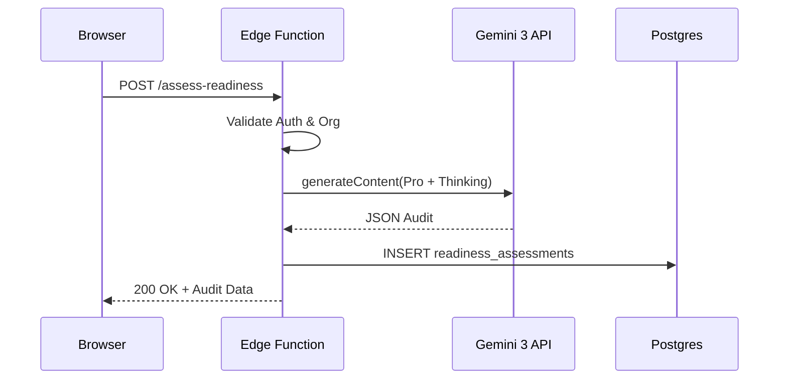
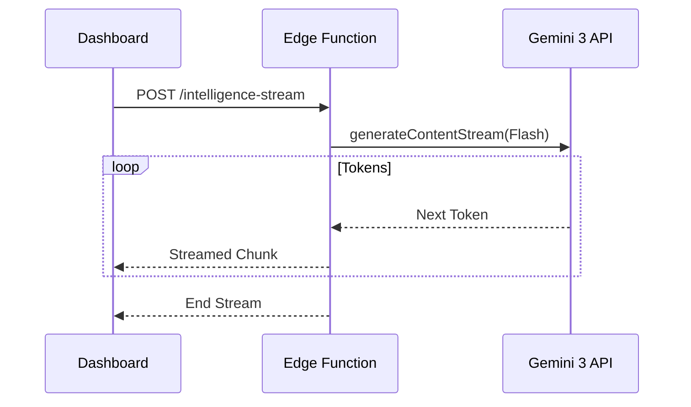

# Sun AI Agency — Supabase Edge Functions Strategy

This document defines the server-side intelligence layer. Edge Functions act as the "Security & Logic Gateway" between the Sun AI Agency UI and the Gemini 3 API.

---

## 1. Purpose of Edge Functions
Edge Functions are the **source of truth** for strategic logic. They ensure:
- **API Security:** Environment variables (Gemini Keys) are never exposed.
- **Data Integrity:** Complex JSON structures are validated before being written to Postgres.
- **Compute Offloading:** Intensive reasoning and market research happen off the main thread.
- **Streaming:** High-fidelity narrative notes are streamed directly to the client.

---

## 2. Write Ownership: The "Secure Buffer" Rule
**Rule:** The Frontend Client (browser) is prohibited from writing to strategic tables (`roadmaps`, `snapshots`, `readiness_assessments`).
- **Logic:** The UI submits raw answers. The Edge Function processes these answers via Gemini, validates the logic, and **the Edge Function performs the DB write** using a Service Role key.
- **Reason:** This prevents "hallucination injection" or manual tampering with readiness scores.

---

## 3. List of Core Edge Functions

| Function Name | Wizard Step | AI Agent | Gemini Model |
| :--- | :--- | :--- | :--- |
| `analyze-business` | Step 1 | Researcher | Flash + Search |
| `generate-diagnostics` | Step 2 | Diagnostic Partner | Flash + Thinking (2k) |
| `recommend-systems` | Step 3 | Architect | Pro + Thinking (1k) |
| `assess-readiness` | Step 4 | Auditor | Pro + Thinking (4k) |
| `generate-roadmap` | Step 5 | Planner | Pro + Thinking (4k) |
| `intelligence-stream` | Dashboard | Executive Partner | Flash (Streaming) |
| `task-generator` | Dashboard | Task Planner | Flash (Structured) |

---

## 4. AI Agent & Gemini Tool Mapping

### The Researcher (`analyze-business`)
- **Tools:** `googleSearch`.
- **Logic:** Verifies company reputation and digital presence. Extracts citations.
- **Persistence:** Writes to `wizard_screen_answers` and logs to `ai_run_logs`.

### The Auditor (`assess-readiness`)
- **Feature:** `thinkingConfig` (42,000+ token capability, target 4k).
- **Logic:** Deep reasoning on how "Manual Work A" + "Data Mess B" = "Risk C".
- **Persistence:** Writes structured JSON to `readiness_assessments`.

### The Planner (`generate-roadmap`)
- **Feature:** `structuredOutputs` (JSON Schema).
- **Logic:** Sequencing phases based on the readiness score.
- **Persistence:** Writes to `roadmaps` and `roadmap_phases`.

---

## 5. Input / Output Contracts (Examples)

### Function: `assess-readiness`
- **Input:** `{ project_id: UUID, wizard_data: Object }`
- **Logic:** 
  1. Validate JWT (User belongs to Project).
  2. Call Gemini 3 Pro with Readiness Prompt.
  3. Decompose response into Score, Areas, and Gaps.
- **Output:** `{ status: "success", data: ReadinessObject }`
- **Side Effect:** DB `INSERT` into `readiness_assessments`.

---

## 6. Security Rules

1. **JWT Validation:** Every function must call `supabase.auth.getUser(token)` first.
2. **Tenant Check:** Verify the `user_id` has a valid membership record for the `org_id` associated with the request.
3. **No Direct Client API:** The frontend is blocked from calling `https://generativelanguage.googleapis.com` via Content Security Policy (CSP).
4. **Service Role Isolation:** Database writes from Edge Functions use the `service_role` key, but are scoped to the `org_id` extracted from the validated JWT.

---

## 7. Failure Handling & Resiliency

- **Timeout Management:** Functions have a 60s timeout. If Gemini takes longer, the function returns a `202 Accepted` and the UI polls for completion.
- **Partial JSON Recovery:** If structured output fails, the function attempts a "repair" prompt or returns a safe default schema.
- **Safety Filters:** If Gemini blocks a response due to safety filters, the function returns a clean "Strategic Block" message instead of a raw API error.

---

## 8. Data Flow Diagrams

### Wizard Step → Edge → Database

### Dashboard → Edge → Streaming Narrative

