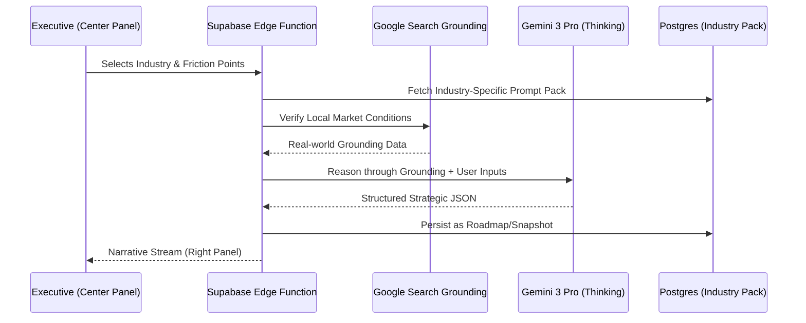

# 18: Industry Intelligence & Automation Strategy

**Architect:** Senior AI Systems Strategist  
**Version:** 1.0 (Enterprise Precision)  
**Objective:** Transition from generic AI advice to domain-specific operational excellence.

---

## 1. The "Industry Engine" Philosophy
Generic AI is a commodity; domain-specific orchestration is an asset. The "Industry Engine" leverages Gemini 3's high-fidelity reasoning and real-world grounding to solve vertical-specific friction points (e.g., "SKU fatigue" in Fashion vs. "Lead leakage" in Real Estate).

### Primary Goals
- **Niche Accuracy:** Ensure every diagnostic question and roadmap outcome uses the specific "language of the trade."
- **Ground Truth:** Use `googleSearch` to verify local market conditions, competitor pricing, and industry trends.
- **Outcome Mapping:** Pair every industry problem with a pre-validated AI system architecture.

---

## 2. Gemini 3 Feature Mapping

| Tool / Feature | Application | Industry Example |
| :--- | :--- | :--- |
| **Google Search Grounding** | Competitive Intelligence | *Fashion:* Tracking competitor "Drop" frequency. |
| **Thinking Mode (4k-8k)** | Supply Chain / CRM Logic | *Real Estate:* Reasoning through lead qualification trees. |
| **Structured Output** | JSON Data Integrity | *SaaS:* Generating standardized churn-risk reports. |
| **Deep Search (Grounding)**| Market Benchmarking | *Travel:* Verifying local event dates for itinerary sync. |
| **Streaming (Flash)** | Real-time Concierge | *Hospitality:* Immediate, grounded responses to guest FAQs. |

---

## 3. Industry-Specific Implementation

### A. Fashion & Retail (DTC/Luxury)
- **Focus:** SKU velocity, PDP conversion, creative supply chains.
- **Agent:** *The Merchandiser Agent.*
- **Logic:** Cross-reference inventory data with social media trends (via Search) to suggest promotional "Drops."

### B. Real Estate (Rentals & Buying)
- **Focus:** Lead response speed, tour qualification, follow-up persistence.
- **Agent:** *The Lead Concierge.*
- **Logic:** Reason through move-in dates and budget constraints to prioritize the highest-probability tours.

### C. Tourism & Experiences
- **Focus:** Seasonal demand, itinerary personalization, review reputation.
- **Agent:** *The Destination Strategist.*
- **Logic:** Use Search grounding to verify real-time weather and local closures before finalizing a 7-day client itinerary.

---

## 4. Technical Workflow (Orchestration)



---

## 5. Database Schema Extensions (`industry_intelligence`)

To support this, we expand the Phase 3 schema with a specialized library.

```sql
-- Industry Content Repository
CREATE TABLE industry_packs (
  id uuid PRIMARY KEY DEFAULT gen_random_uuid(),
  slug text UNIQUE NOT NULL, -- e.g., 'fashion-retail'
  display_name text NOT NULL,
  system_prompt_extension text NOT NULL,
  diagnostic_template jsonb NOT NULL, -- The Screen 2 structure
  recommended_engines jsonb NOT NULL -- The Screen 3 library
);

-- Real-time Market Benchmarks (Grounding Cache)
CREATE TABLE industry_vitals (
  id uuid PRIMARY KEY DEFAULT gen_random_uuid(),
  industry_slug text REFERENCES industry_packs(slug),
  metric_name text NOT NULL, -- e.g., 'Avg. Lead Response Time'
  benchmark_value numeric,
  source_citations jsonb,
  updated_at timestamp with time zone DEFAULT now()
);
```

---

## 6. Phase Integration

### Phase 1: Discovery (Wizard)
- **Task:** Use the "Industry Pack" to generate Step 2 questions.
- **Gemini Feature:** `responseSchema` to enforce vertical-specific options.

### Phase 2: Execution (Dashboard)
- **Task:** Proactive "Market Pulse" alerts in the Right Panel.
- **Gemini Feature:** `googleSearch` grounding to check news/competitors.

### Phase 3: Ops (Infrastructure)
- **Task:** Secure Edge Functions (`wizard-step-2-diagnostic`) that load the `industry_pack` based on user `industry` selection.

---

## 7. Success Criteria

1. **Diagnostic Relevance:** >90% of Step 2 options are rated as "High Relevance" by test users in that sector.
2. **Grounding Accuracy:** Every Search-grounded claim in the dashboard has at least 2 valid URI citations.
3. **Logic Depth:** "Phase 0" remediation actions in the roadmap address specific industry risks (e.g., "Verify permit status" for Real Estate).
4. **Editorial Tone:** Zero "AI buzzwords" (synergy, leverage); 100% "Business outcomes" (revenue, speed, sell-through).

---
*Created by Sun AI Architectural Council*
