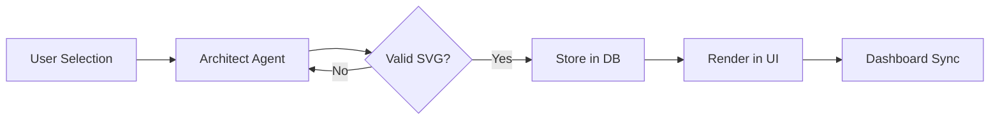

# Prompt 06: Architecture SVG Reification

### A) Task Reference
- **Task ID:** #7
- **Name:** Architecture SVG Reification
- **Priority:** P1 (High)
- **Why:** The SVG architecture diagram is currently generated on-the-fly and lost on refresh. Executives need to "see" their blueprint as a persistent asset.

### B) Description
This feature ensures the AI-generated "Modular AI Blueprint" (SVG) is correctly generated, stored in the Supabase database, and rendered consistently.

### C) Purpose & Goals
- [ ] Trigger SVG generation exactly once per system selection.
- [ ] Save the raw SVG string to `context_snapshots.svg_blueprint`.
- [ ] Implement a `BlueprintViewer` component with pan/zoom capabilities.
- [ ] Ensure the SVG adheres to the "Charon" (minimalist) style guide.

### D) Screens / Routes
- **Wizard:** Step 3 (Systems Architecture).
- **Dashboard:** Systems tab.

### E) UI/UX Layout (3-Panel Core Model)
- **Main Panel:** The blueprint should be the centerpiece of Step 3 once systems are selected.
- **Interaction:** Add a "Download Blueprint" button (PNG/SVG).
- **Style:** Black lines, high-contrast, no background.

### F) User Journey (Step-by-Step)
1. User selects "Growth Engine" and "Support Concierge" in Step 3.
2. App sends selection to `recommend-systems` Edge Function.
3. Gemini 3 Flash generates the SVG markup.
4. Edge Function saves SVG to DB.
5. UI displays the blueprint.
6. User moves to Step 4, then back to Step 3; the blueprint is still there.

### G) Features & Logic
- **Idempotency:** Do not re-generate the SVG if the selection hasn't changed.
- **Sanitization:** Clean the AI output (remove markdown code blocks ```svg) before storing.

### H) AI Agents
- **Agent:** The Architect.
- **Role:** Visualizing system logic.

### I) Gemini 3 Features & Tools
- **Model:** Flash.
- **System Instruction:** Strict rules for SVG XML structure.

### J) Workflows & Automations
| Trigger | Agent / Service | Action | Output | Stored Where |
|------|---------------|--------|--------|-------------|
| System Selection | Architect Agent | Draw Blueprint | SVG XML | `context_snapshots` |

### K) Success Criteria
- [ ] SVG is valid and renders without broken tags.
- [ ] Diagram correctly shows links between "Website" and the selected AI systems.
- [ ] Data is stored in the `context_snapshots` table.

### L) Production-Ready Checklist
- [ ] UX: Pan/Zoom controls for complex diagrams.
- [ ] Security: Sanitize SVG against script injection.

### M) Mermaid Diagram
