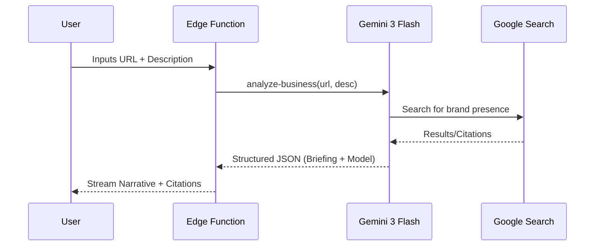

# Prompt 09: The Strategic Researcher (Step 1 Intelligence)

### A) Task Reference
- **Task ID:** P1-W09
- **Priority:** HIGH
- **Phase:** Phase 1 - Wizard (Step 1)
- **Status:** Not Started

---

### B) Description
Upgrade the initial business context collection to a deep research phase. As the user provides a company name and website, a "Researcher Agent" verifies the digital footprint, crawls the URL, and identifies the business model using real-time search grounding.

### C) Purpose & Goals
1. **Verify Identity:** Cross-reference company data with Google Search results.
2. **Detect Service Maturity:** Analyze the provided website to identify current service offerings.
3. **Establish Baseline:** Generate a "Strategic Briefing" that reflects the user's business model back to them with high-end vocabulary.
4. **Citations:** Provide transparent source links for all market claims.

### D) Screens / Routes
- **Affected Screen:** `Step1Context.tsx`
- **Route:** `/wizard/1`

### E) UI/UX Layout (3-Panel Core Model)
- **Left Panel:** Progress 20%. Shows "Identifying Business Model..."
- **Center Panel:** Form inputs (Name, Company, URL, Industry, Description).
- **Right Panel:** Intelligence panel showing a streaming "Research Log" followed by the final "Consultant Note."

### F) User Journey
1. **User Action:** User enters `Website URL` and a 50+ character description.
2. **Trigger:** `onBlur` or `Debounce` triggers the `analyze-business` Edge Function.
3. **AI Action:** Gemini 3 Flash uses `googleSearch` to crawl the URL and search for press/reviews.
4. **UI Update:** The Right Panel streams: "Connecting to server... Found Shopify storefront... Detecting B2C High-Ticket Luxury model..."
5. **Final State:** Right panel displays a 3-paragraph executive summary with citations.

### G) Features & Logic
- **Grounding:** Must use `googleSearch` tool.
- **Trigger Logic:** Triggers only when `industry` is selected AND `description.length > 50`.
- **Citations:** Extract `groundingChunks` and render as a "Market References" list.

### H) AI Agents
- **Agent Type:** The Researcher.
- **Role:** Data Acquisition & Verification.
- **Tools:** `googleSearch`, `URL context`.

### I) Gemini 3 Features & Tools
- **Model:** `gemini-3-flash-preview`
- **Feature:** Google Search Grounding.
- **Output:** Structured JSON for model detection + Streaming text for narrative.

### J) Workflows & Automations
| Trigger | Service | Action | Output |
|---------|---------|--------|--------|
| Form Valid | Edge Function | `analyze-business` | Citations + Briefing |

### K) Mermaid Diagram
