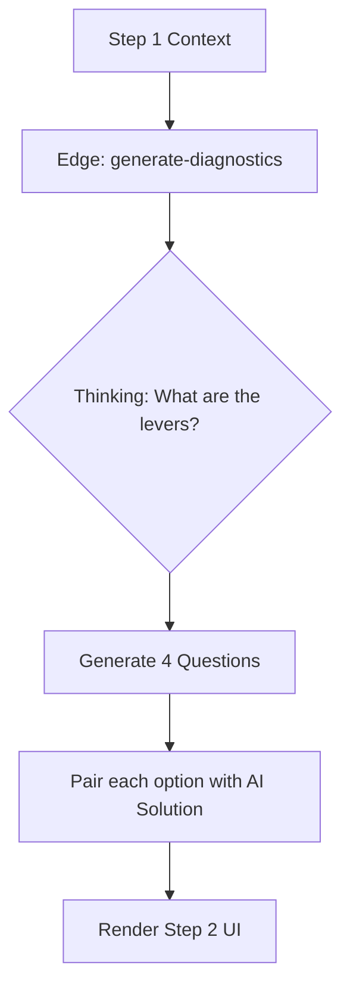

# Prompt 10: The Diagnostic Architect (Step 2 Intelligence)

### A) Task Reference
- **Task ID:** P1-W10
- **Priority:** HIGH
- **Phase:** Phase 1 - Wizard (Step 2)
- **Status:** Not Started

---

### B) Description
Transition from static diagnostic templates to a "Generative Audit." Based on the business model detected in Step 1, this agent creates 4 industry-specific questions, each paired with a unique "AI Solution Preview" that appears when an option is selected.

### C) Purpose & Goals
1. **Hyper-Personalization:** Ensure questions use industry-specific nouns (e.g., "SKU" for Fashion, "Listings" for Real Estate).
2. **Problem-Solution Pairing:** Every diagnostic option must have a corresponding "Proposed AI Fix."
3. **Strategic Justification:** Explain *why* the diagnostic is focusing on specific areas in the Right Panel.

### D) Screens / Routes
- **Affected Screen:** `Step2Diagnostics.tsx`
- **Route:** `/wizard/2`

### E) UI/UX Layout (3-Panel Core Model)
- **Left Panel:** Displays Step 1 Summary (Model, Industry).
- **Center Panel:** 4 Vertical sections. When an option is clicked, a "Proposed Engine" sub-card slides out below.
- **Right Panel:** Streams a "Diagnostic Philosophy" note (e.g., "In Luxury Retail, inventory friction is the primary growth ceiling...").

### F) User Journey
1. **Entry:** User arrives from Step 1.
2. **AI Action:** App calls `generate-diagnostics` with the research context from Step 1.
3. **UI Update:** Center panel populates with bespoke questions.
4. **Interaction:** User selects "Manual Customer Support."
5. **UI Update:** An amber-bordered card appears: "Solution: 24/7 AI Concierge Engine. Impact: 40% reduction in response time."

### G) Features & Logic
- **Thinking Budget:** Use 2048 tokens for "reasoning through industry levers."
- **Schema:** Strict `responseSchema` to ensure every question has 4 options and 4 solutions.

### H) AI Agents
- **Agent Type:** The Architect (Systems Logic).
- **Role:** Mapping Pain to Engine.
- **Output:** `DiagnosticQuestionSet`.

### I) Gemini 3 Features & Tools
- **Model:** `gemini-3-pro-preview`
- **Feature:** Thinking Budget (2k).
- **Tool:** Structured Outputs.

### J) Mermaid Diagram
