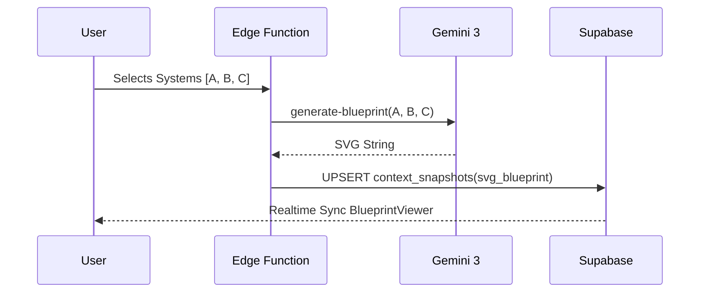

# Prompt 11: Modular System Architect (Step 3 Intelligence)

### A) Task Reference
- **Task ID:** P1-W11
- **Priority:** HIGH
- **Phase:** Phase 1 - Wizard (Step 3)
- **Status:** Not Started

---

### B) Description
Replace hardcoded system cards with dynamic AI recommendations. The agent analyzes Step 2 selections to propose 5 modular AI engines. Selecting systems triggers the "Architectural Blueprint" (SVG) which must now be persisted to the database.

### C) Purpose & Goals
1. **Dynamic Recommendation:** Recommend systems that specifically solve the blockers selected in Step 2.
2. **Visualization:** Generate a valid SVG XML blueprint showing Website -> System data flows.
3. **Persistence:** Store the SVG in `context_snapshots` so it survives refresh and appears in the dashboard.

### D) Screens / Routes
- **Affected Screen:** `Step3Systems.tsx`
- **Route:** `/wizard/3`

### E) UI/UX Layout (3-Panel Core Model)
- **Left Panel:** "Active Blueprint" stats (Engines selected, connectivity score).
- **Center Panel:** 5-8 Dynamic Recommendation Cards + `BlueprintViewer` component.
- **Right Panel:** "Architect's Rationale" — Streaming explanation of how these systems integrate.

### F) User Journey
1. **Entry:** Step 3 loads, calling `recommend-systems`.
2. **AI Action:** Gemini 3 Pro selects the best 5 engines from a library of 20+.
3. **Interaction:** User selects their top 3 systems.
4. **Automation:** `getArchitectureBlueprint` is triggered.
5. **Persistence:** The SVG is saved to Supabase.
6. **UI Update:** The blueprint renders below the cards.

### G) Features & Logic
- **Idempotency:** Only generate blueprint when selection array changes.
- **Format:** Ensure SVG is minimalist (black lines, high contrast).

### H) AI Agents
- **Agent Type:** The Architect.
- **Role:** System Design & Visualization.

### I) Gemini 3 Features & Tools
- **Model:** `gemini-3-flash-preview` (for SVG) and `gemini-3-pro-preview` (for logic).
- **Output:** SVG XML string.

### J) Mermaid Diagram
