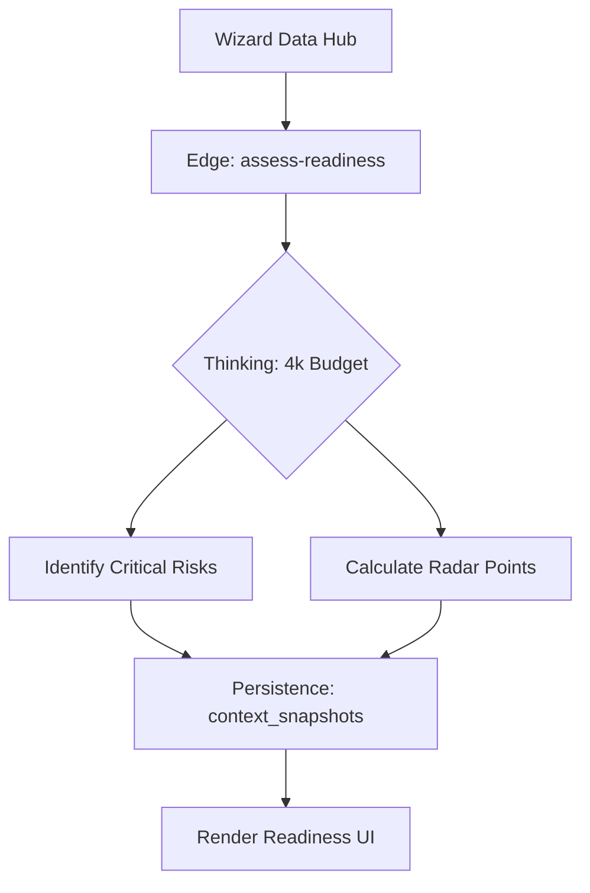

# Prompt 12: Operational Risk Auditor (Step 4 Intelligence)

### A) Task Reference
- **Task ID:** P1-W12
- **Priority:** HIGH
- **Phase:** Phase 1 - Wizard (Step 4)
- **Status:** Not Started

---

### B) Description
Perform a deep-reasoning audit of the organization's capacity to implement the selected systems. This agent uses a high thinking budget to identify non-obvious risks and calculate a multi-dimensional readiness score.

### C) Purpose & Goals
1. **Evidence-Based Scoring:** Calculate Data, Infrastructure, and Culture scores based on specific user inputs.
2. **Gap Identification:** List exactly what must happen in "Phase 0" before AI can be deployed.
3. **Confidence Scoring:** Provide a "Consultant Confidence Level" (High/Med/Low) with a specific reason.

### D) Screens / Routes
- **Affected Screen:** `Step4Readiness.tsx`
- **Route:** `/wizard/4`

### E) UI/UX Layout (3-Panel Core Model)
- **Left Panel:** Overall Readiness Score (Radial).
- **Center Panel:** Radar Chart + "Strategic Gaps" grid.
- **Right Panel:** "Consultant's Hard Truth" — A blunt, professional assessment of risks.

### F) User Journey
1. **AI Action:** On mount, triggers `assess-readiness`.
2. **Thinking:** Gemini 3 Pro reasons for ~15-20 seconds about the data/culture gap.
3. **UI Update:** Radar chart animates from 0.
4. **Insight:** User sees: "Risk: Fragmented Customer Data. Impact: Personalization Engine will fail without CRM cleanup."

### G) Features & Logic
- **Thinking Budget:** 4096 tokens (Max).
- **Scoring Logic:** Logic must be consistent across audits (0.0 to 1.0 floats).

### H) AI Agents
- **Agent Type:** The Auditor.
- **Role:** Risk Assessment & Gap Analysis.

### I) Gemini 3 Features & Tools
- **Model:** `gemini-3-pro-preview`
- **Feature:** Thinking Budget (4k).
- **Tool:** Structured Output (JSON).

### J) Mermaid Diagram
