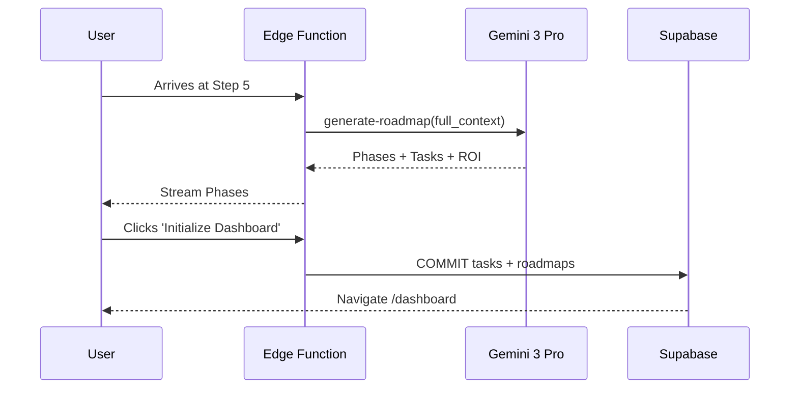

# Prompt 13: 90-Day Strategy Sequencer (Step 5 Intelligence)

### A) Task Reference
- **Task ID:** P1-W13
- **Priority:** HIGH
- **Phase:** Phase 1 - Wizard (Step 5)
- **Status:** Not Started

---

### B) Description
Synthesize all wizard data into a 3-phase execution roadmap. The agent decomposes high-level phases into specific dashboard tasks, assigning ownership and effort levels.

### C) Purpose & Goals
1. **Phased Sequencing:** Order implementation to front-load ROI.
2. **Task Decomposition:** Create 5-10 actionable tasks per phase.
3. **ROI Projection:** Estimate time/cost savings in plain language.
4. **Transition:** Prepare the user for the "Launch" into the Dashboard.

### D) Screens / Routes
- **Affected Screen:** `Step5Roadmap.tsx`
- **Route:** `/wizard/5`

### E) UI/UX Layout (3-Panel Core Model)
- **Left Panel:** Roadmap Summary (Timeline).
- **Center Panel:** 3 Large Phase Cards. Each phase is expandable to show "High-Velocity Tasks."
- **Right Panel:** "The Executive Brief" — Streaming summary of the 90-day philosophy.

### F) User Journey
1. **AI Action:** Triggers `generate-roadmap`.
2. **Thinking:** Gemini 3 Pro sequences the "Quick Wins" vs "Heavy Implementation."
3. **UI Update:** Phases stream in.
4. **Action:** User clicks "Launch Dashboard."
5. **System Action:** Tasks are persisted to the `tasks` table.

### G) Features & Logic
- **Task Logic:** Tasks must be categorized as `client` or `ai` owner.
- **Effort Mapping:** Low/Med/High based on Readiness Score.

### H) AI Agents
- **Agent Type:** The Strategist.
- **Role:** Roadmap Sequencing & Task Planning.

### I) Gemini 3 Features & Tools
- **Model:** `gemini-3-pro-preview`
- **Feature:** Thinking Budget (4k).
- **Tool:** Structured Output.

### J) Workflows & Automations
| Trigger | Service | Action | Stored Where |
|---------|---------|--------|--------------|
| Launch Click | Edge Function | `task-generator` | `tasks` table |

### K) Mermaid Diagram
