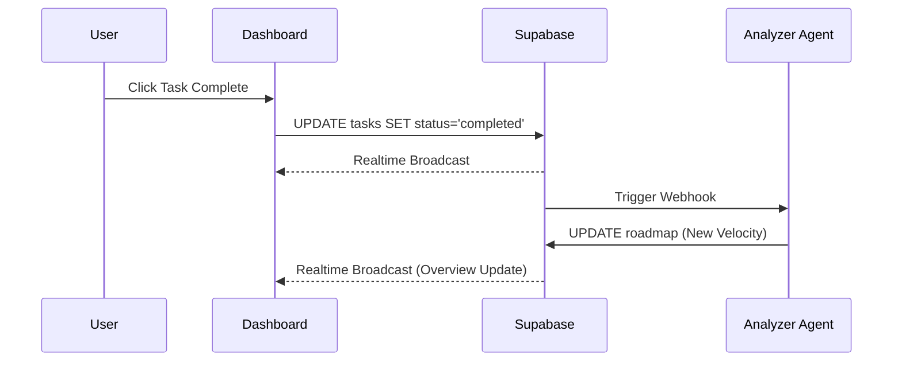

# Prompt 05: Live Data Sync (Dashboard)

### A) Task Reference
- **Task ID:** #6 & #10
- **Name:** Live Data Synchronization & Real Health Checks
- **Priority:** P1 (High)
- **Why:** The dashboard currently shows "In Deployment" for every system regardless of reality. It needs to reflect actual database state and simulated engine health.

### B) Description
This feature wires the Dashboard UI tabs (Tasks, Roadmap, Systems) to the Supabase Postgres DB using Realtime subscriptions.

### C) Purpose & Goals
- [ ] Replace `tasks` state with a real-time listener on the `tasks` table.
- [ ] Implement `toggleTaskStatus` Edge Function (or direct SQL update) that updates the DB.
- [ ] Create a "Health Check" service that pings simulated AI endpoints.
- [ ] Display real "Last Updated" timestamps for the strategy snapshot.

### D) Screens / Routes
- **Dashboard:** Overview, Tasks, Systems tabs.

### E) UI/UX Layout (3-Panel Core Model)
- **Right Panel (Intelligence):** When a task is completed, the intelligence panel should stream a new note (e.g., "Founder input received. Re-calculating Phase 2 velocity...").
- **Empty States:** If no tasks exist, show a "Generating High-Velocity Actions..." skeleton.

### F) User Journey (Step-by-Step)
1. User navigates to `/dashboard/tasks`.
2. UI fetches all tasks for the current `org_id`.
3. User clicks "Complete" on a task.
4. UI optimisticly updates, then calls DB.
5. Supabase Realtime notifies the app of the change.
6. The `Overview` tab's "Velocity" metric updates automatically.

### G) Features & Logic
- **Realtime:** Use `supabase.channel('public:tasks').on(...)`.
- **Health Logic:** A `SystemsTab` item should show "Online" only if a corresponding record exists in `system_health` table.

### H) AI Agents
- **Agent:** The Analyzer.
- **Role:** Monitoring task completion and flagging risks.

### I) Gemini 3 Features & Tools
- **Model:** Flash (for fast health analysis).
- **Streaming:** Narrative updates on task completion.

### J) Workflows & Automations
| Trigger | Agent / Service | Action | Output | Stored Where |
|------|---------------|--------|--------|-------------|
| Task Completed | Analyzer Agent | Re-score Velocity | New Metric | `roadmaps.roi_projection` |

### K) Success Criteria
- [ ] Toggling a task on mobile is instantly reflected on a desktop dashboard.
- [ ] "Active Engines" count on Overview matches the `systems` table.

### L) Production-Ready Checklist
- [ ] UX: Smooth transition animations for progress bars.
- [ ] Stability: Handle WebSocket disconnection gracefully.

### M) Mermaid Diagram
