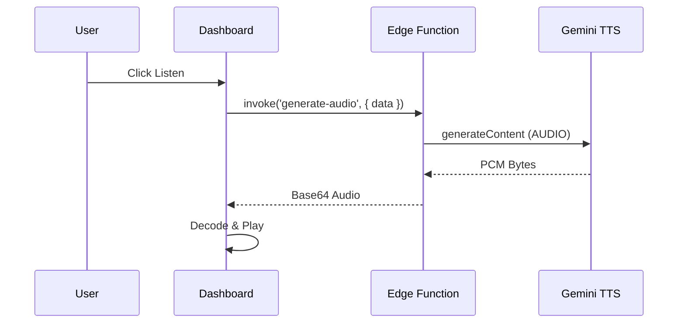

# Prompt 08: Narrative Audio Briefings

### A) Task Reference
- **Task ID:** #11
- **Name:** Narrative Audio Briefing
- **Priority:** P3 (Nice-to-Have)
- **Why:** Busy executives consume content via audio. A daily "Strategic Briefing" reinforces the premium agency feel.

### B) Description
This feature uses `gemini-2.5-flash-preview-tts` to convert the Dashboard's "Intelligence Notes" into a spoken-word briefing.

### C) Purpose & Goals
- [ ] Add a "Listen to Strategy" button to the Dashboard.
- [ ] Synthesize the current `roadmap` and `risk_assessment` into a 60-second script.
- [ ] Play audio using the browser's `AudioContext`.
- [ ] Implement playback controls (Play/Pause/Stop).

### D) Screens / Routes
- **Dashboard:** Overview tab.

### E) UI/UX Layout (3-Panel Core Model)
- **Right Panel (Intelligence):** Add an "Audio Waveform" visualizer next to the "Sun Intelligence" header.
- **Player:** A minimalist floating player bar at the bottom of the right panel.

### F) User Journey (Step-by-Step)
1. User logs into Dashboard.
2. User clicks "Listen to Briefing."
3. App calls `generateContent` with `Modality.AUDIO`.
4. Audio starts playing in a calm, professional voice ("Kore" or "Zephyr").
5. User navigates between tabs while audio continues.

### G) Features & Logic
- **Audio Modality:** Use `responseModalities: [Modality.AUDIO]`.
- **Decoding:** Implement the PCM decoding logic from the Live API guidelines.

### H) AI Agents
- **Agent:** The Voice (Consultant).

### I) Gemini 3 Features & Tools
- **Model:** `gemini-2.5-flash-preview-tts`.
- **Voice:** Prebuilt voice configuration (`voiceName: 'Kore'`).

### J) Workflows & Automations
| Trigger | Agent / Service | Action | Output | Stored Where |
|------|---------------|--------|--------|-------------|
| Play Click | TTS Agent | Generate Audio | PCM Bytes | Volatile Memory |

### K) Success Criteria
- [ ] Audio is clear and the pronunciation of business terms is correct.
- [ ] Playback stops correctly when the user leaves the tab.
- [ ] No "Robotic" speech patterns; tone matches the editorial persona.

### L) Production-Ready Checklist
- [ ] UX: Volume controls and "Skip 10s" buttons.
- [ ] Performance: Audio data is handled as raw PCM to avoid high memory usage.

### M) Mermaid Diagram
