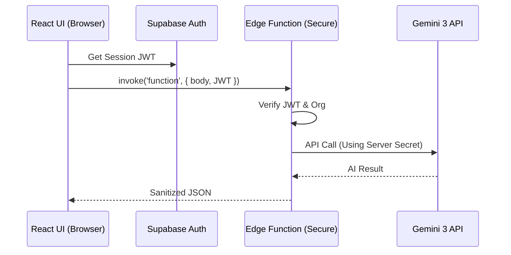

# Prompt 01: Security Gateway & Edge Proxy

### A) Task Reference
- **Task ID:** #1 & #2
- **Name:** Kill Client-Side Keys & Edge Function Proxying
- **Priority:** P0 (Blocker)
- **Why:** Current architecture exposes the `GEMINI_API_KEY` in the browser's network tab. This task moves all AI orchestration to the server.

### B) Description
This feature creates a secure bridge between the Sun AI Agency frontend and the Gemini 3 API. It replaces direct SDK calls in `App.tsx` with authenticated Supabase Edge Function invocations.

### C) Purpose & Goals
- [ ] Remove all `process.env.API_KEY` references from the frontend bundle.
- [ ] Implement a standardized `invoke` pattern in `App.tsx`.
- [ ] Ensure every AI call is validated by a JWT.
- [ ] Maintain streaming functionality for the "Intelligence" panel via the proxy.

### D) Screens / Routes
- **Routes:** All `/wizard` steps and `/dashboard`.
- **Entry:** User interaction (typing in Step 1, selecting systems in Step 3).
- **Exit:** Structured JSON or Text Stream returned to UI.

### E) UI/UX Layout (3-Panel Core Model)
- **Left (Context):** Unaffected.
- **Main (Work):** Displays a "Secure Connection established" toast/indicator when the first Edge Function is successfully called.
- **Right (Intelligence):** Errors from the proxy (e.g., 401 Unauthorized or 429 Rate Limit) must be rendered as "Consultant Narrative" (e.g., "The secure line is currently congested. Re-establishing connection...").

### F) User Journey (Step-by-Step)
1. User enters data in a Wizard step.
2. `useEffect` in `App.tsx` triggers.
3. Instead of calling `getBusinessIntelligence` (local), it calls `supabase.functions.invoke('analyze-business', { body: data })`.
4. The Edge Function verifies the user's JWT and organization membership.
5. The Edge Function calls Gemini using the server-side secret key.
6. The UI receives the data and updates the `userData` state.

### G) Features & Logic
- **Proxy Logic:** All parameters (industry, description, etc.) must be sanitized before being sent to the Edge Function.
- **Token Handling:** The Supabase Auth token must be automatically injected into the `Authorization` header of every invocation.
- **Failure Mode:** If the Edge Function returns a 5xx, the UI must retry up to 3 times with exponential backoff.

### H) AI Agents
- **Agent:** The Security Proxy (System Layer).
- **Role:** Sanitization and Validation.
- **Outputs:** Verified Gemini payloads.

### I) Gemini 3 Features & Tools
- **Model:** All (Flash/Pro/Search).
- **Streaming:** Support for `intelligence-stream` SSE.
- **Secrets:** Keys managed via `supabase secrets set GEMINI_API_KEY=...`.

### J) Workflows & Automations
| Trigger | Agent / Service | Action | Output | Stored Where |
|------|---------------|--------|--------|-------------|
| Wizard Step Submit | Edge Proxy | JWT Check + AI Call | Structured JSON | `wizard_answers` |

### K) Success Criteria
- [ ] Browser "Network" tab shows calls to `functions.supabase.co`, not `generativelanguage.googleapis.com`.
- [ ] Removing `process.env.API_KEY` from the environment does not break the app.
- [ ] Unauthorized users (no JWT) receive a 401 error.

### L) Production-Ready Checklist
- [ ] Security: No keys in frontend code.
- [ ] Security: CORS headers restricted to specific domains.
- [ ] Performance: Latency overhead of proxy < 200ms.

### M) Mermaid Diagram
