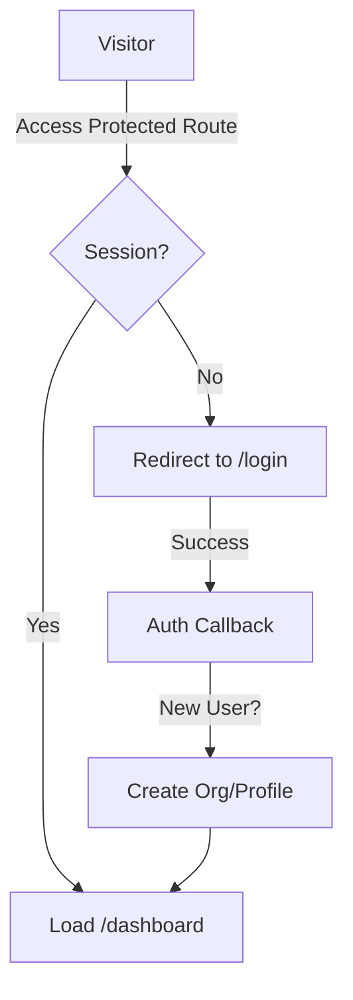

# Prompt 02: Executive Entry (Auth)

### A) Task Reference
- **Task ID:** #3
- **Name:** Implement Executive Entry
- **Priority:** P0 (Blocker)
- **Why:** High-end consulting requires data privacy. Currently, any visitor can see/overwrite the "Local State" strategy.

### B) Description
A premium authentication experience that segments users into Organizations. This provides a "Gate" to the strategy hub, ensuring that "Founder A" never sees the roadmap of "Founder B."

### C) Purpose & Goals
- [ ] Create a minimalist, editorial Login/Signup screen.
- [ ] Implement an `AuthProvider` using Supabase GoTrue.
- [ ] Automatically create a default `Organization` for every new Signup.
- [ ] Guard all `/wizard` and `/dashboard` routes behind an active session.

### D) Screens / Routes
- **Routes:** `/login`, `/signup`, `/auth/callback`.
- **Protected:** `/wizard/*`, `/dashboard/*`.

### E) UI/UX Layout (3-Panel Core Model)
- **Login Screen:** A distraction-free, single-column layout centered on the screen. 
- **Typography:** Use `Playfair Display` for the "Welcome Back, Founder" heading.
- **Interactions:** Use a "Magic Link" or simple email/password flow with a "Premium Loading" transition (fade-to-black).

### F) User Journey (Step-by-Step)
1. User lands on `/`.
2. User clicks "Initialize Audit."
3. App redirects to `/login`.
4. User signs up/in.
5. Auth Provider detects session and redirects to `/wizard/step-1`.

### G) Features & Logic
- **Org Creation:** On the first signup, a trigger in Supabase (or logic in the Auth callback) must create an entry in the `organizations` and `org_members` tables.
- **Persistence:** The `userData` from the wizard must be linked to the `user.id` and `org_id`.

### H) AI Agents
- **N/A** (Pure Infrastructure).

### I) Gemini 3 Features & Tools
- **N/A** (Pure Infrastructure).

### J) Workflows & Automations
| Trigger | Agent / Service | Action | Output | Stored Where |
|------|---------------|--------|--------|-------------|
| User Signup | Supabase Auth | Create Org + Profile | Profile Object | `profiles`, `org_members` |

### K) Success Criteria
- [ ] Unauthenticated users are redirected to `/login` if they try to access `/dashboard`.
- [ ] Successful login redirects to the last known wizard step.
- [ ] "Log Out" clears all local state and tokens.

### L) Production-Ready Checklist
- [ ] Security: RLS enabled on `profiles` and `organizations`.
- [ ] UX: Clear error messages for invalid credentials.
- [ ] Testing: Verify "Forgot Password" flow works.

### M) Mermaid Diagram
