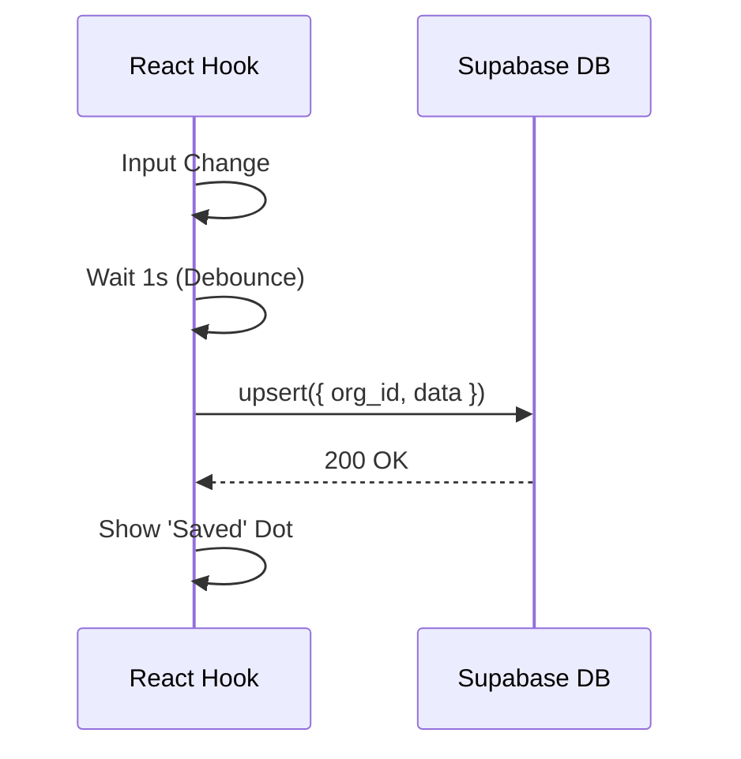

# Prompt 03: SQL Persistence Layer

### A) Task Reference
- **Task ID:** #4
- **Name:** SQL Schema Migration
- **Priority:** P1 (High)
- **Why:** Executives need to start an audit on mobile and finish on desktop. LocalStorage cannot support multi-device strategy sessions.

### B) Description
Migration of the ephemeral `userData` state to a relational Supabase Postgres database. This enables long-term storage of roadmaps, tasks, and system architectures.

### C) Purpose & Goals
- [ ] Execute the SQL schema defined in `docs/supabase-plan.md`.
- [ ] Update `useWizard` hook to read/write from `wizard_answers` table.
- [ ] Implement an "Auto-Save" debounced pattern for text inputs.
- [ ] Ensure `selectedSystems` are correctly stored as a JSONB array.

### D) Screens / Routes
- **Back-end:** Postgres DB.
- **Front-end:** All Wizard steps.

### E) UI/UX Layout (3-Panel Core Model)
- **Top Header:** Add a small "Changes Saved" indicator (faint text or a small amber dot) that pulses when the DB is being updated.
- **Empty State:** If a user returns to a partial session, show a "Welcome back. Resuming your strategic audit..." overlay.

### F) User Journey (Step-by-Step)
1. User types in a description in Step 1.
2. `useWizard` hook waits for 1000ms of inactivity.
3. Hook triggers an `upsert` call to Supabase.
4. User closes browser.
5. User re-opens browser, logs in, and Step 1 is pre-populated with their previous text.

### G) Features & Logic
- **RLS:** Every SQL query MUST include the `org_id` in the `WHERE` clause to satisfy Row Level Security.
- **Conflict Resolution:** Use `ON CONFLICT (session_id, screen_id) DO UPDATE`.

### H) AI Agents
- **N/A** (Infrastructure).

### I) Gemini 3 Features & Tools
- **N/A** (Infrastructure).

### J) Workflows & Automations
| Trigger | Agent / Service | Action | Output | Stored Where |
|------|---------------|--------|--------|-------------|
| Input Change | useWizard Hook | Debounced Upsert | DB Record | `wizard_answers` |

### K) Success Criteria
- [ ] Page refresh does not clear form inputs.
- [ ] Data is visible in the Supabase Dashboard "Table Editor."
- [ ] Different users cannot see each other's data even if they know the UUIDs (tested via RLS).

### L) Production-Ready Checklist
- [ ] Data: Indexes created on `org_id` and `session_id`.
- [ ] Security: All tables have RLS `ENABLE`.
- [ ] UX: "Saving..." indicator is non-obtrusive.

### M) Mermaid Diagram
