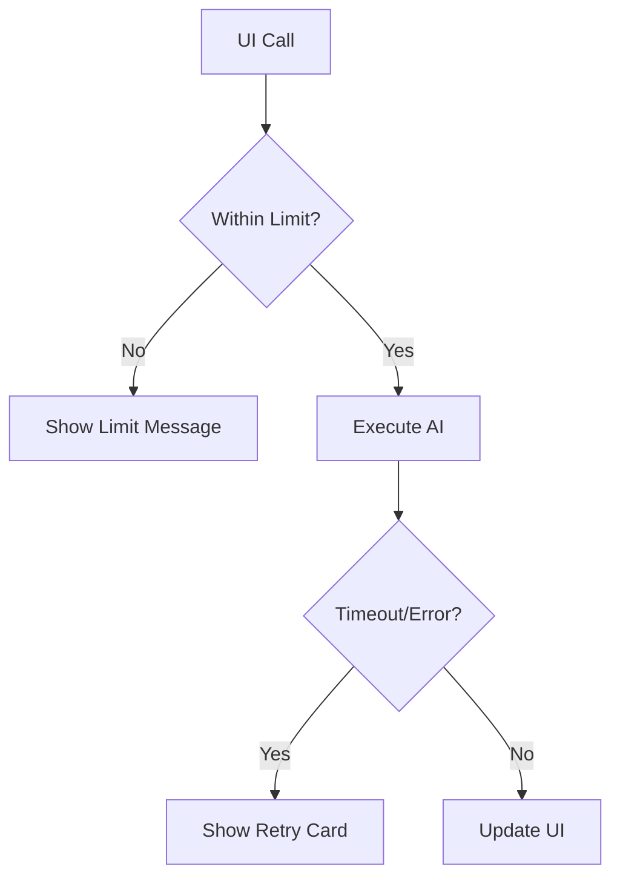

# Prompt 07: Operational Stability (Scaling & UX)

### A) Task Reference
- **Task ID:** #8, #9, #12
- **Name:** Thinking Budgets, Error Refinement, Rate Limiting
- **Priority:** P2 (Medium)
- **Why:** High-stakes AI can be slow or fail. We need to manage latency and costs while providing a premium, "calm" user experience.

### B) Description
A suite of technical refinements focused on the reliability of the AI orchestration layer.

### C) Purpose & Goals
- [ ] Optimize `thinkingBudget` for Steps 2, 4, 5 (balancing depth vs. 60s timeout).
- [ ] Implement `ErrorBoundary` components for every panel.
- [ ] Implement server-side rate limiting (100 runs/hr) in the `_shared` Edge Function logic.
- [ ] Create a "Strategic Offline" state for when API limits are hit.

### D) Screens / Routes
- **Global:** Affects all AI-driven components.

### E) UI/UX Layout (3-Panel Core Model)
- **Right Panel (Intelligence):** During "Thinking" (Step 4/5), show a distinct progress indicator: "Consultant is reasoning through operational dependencies..."
- **Error States:** Replace red text/error logs with a premium "Strategy Interrupted" card with a "Retry" button.

### F) User Journey (Step-by-Step)
1. User enters Step 4 (Audit).
2. Gemini 3 Pro takes 15 seconds to "Think."
3. UI shows a "Deep Audit in progress" animation.
4. If the call fails, a graceful message appears: "Our intelligence systems are currently recalibrating. One moment."
5. If the user hits their limit, they see: "Strategic capacity reached for this hour. Resuming shortly."

### G) Features & Logic
- **Rate Limit:** Use a `usage_logs` table in Supabase to count requests per `org_id`.
- **Timeouts:** Ensure the UI doesn't hang forever; use a 60s abort controller.

### H) AI Agents
- **Agent:** The Gatekeeper (Middleware).

### I) Gemini 3 Features & Tools
- **Thinking Budget:** 4096 tokens for Roadmap/Readiness.
- **429 Handling:** Catch `429` errors and translate them into founder-friendly language.

### J) Workflows & Automations
| Trigger | Agent / Service | Action | Output | Stored Where |
|------|---------------|--------|--------|-------------|
| AI Call | Gatekeeper | Increment Counter | Success/Block | `usage_logs` |

### K) Success Criteria
- [ ] No raw "429 Too Many Requests" errors visible to the user.
- [ ] "Retry" button successfully restores the wizard state.
- [ ] Total latency for a Pro audit stays under 30 seconds.

### L) Production-Ready Checklist
- [ ] Performance: Optimized thinking budget to avoid Edge Function timeouts.
- [ ] Security: Rate limits protect against credit-card-draining bot attacks.

### M) Mermaid Diagram
