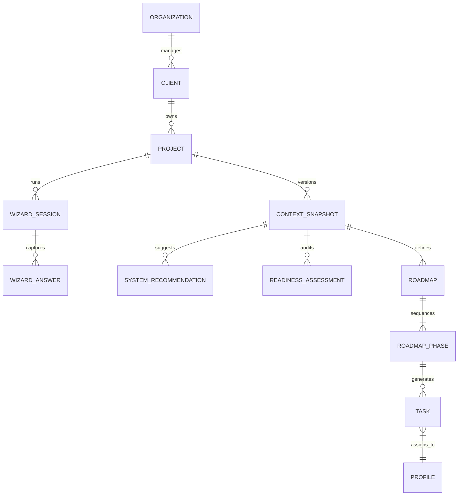
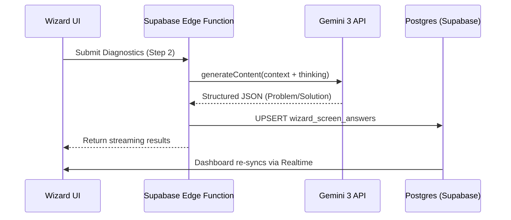

# Sun AI Agency — Supabase Architecture & Persistence Strategy

This document defines the production-grade data architecture for Sun AI Agency. It transitions the platform from a local-state wizard to a multi-tenant, AI-orchestrated SaaS platform.

---

## 1. System Overview

Supabase serves as the backend backbone, providing identity, persistence, and secure compute for AI agents.

### Core Architectural Pillars
- **Identity & Access:** Multi-tenant isolation for Agency Admins (Consultants) and Clients (Founders).
- **Strategy Persistence:** Versioned storage of "Strategic Snapshots" (Business model, friction points, readiness).
- **Execution Tracking:** Dynamic Postgres-backed task management synchronized with AI roadmap generation.
- **AI Orchestration:** Edge Functions acting as the secure bridge between the Database and Gemini 3 API.

### High-Level Data Flow
1. **Wizard:** Answers are captured in `wizard_sessions` and `wizard_screen_answers`.
2. **AI Processing:** Edge Functions fetch session data, call Gemini 3 (Pro/Flash), and write structured outputs to `readiness_assessments` and `roadmaps`.
3. **Execution:** The Dashboard reads from `roadmaps` and `tasks` filtered by `client_id` via Row Level Security (RLS).

---

## 2. Core Data Model (Schema)

### 2.1 Identity & Organizations
| Table | Purpose | Relationships |
| :--- | :--- | :--- |
| `organizations` | High-level account (The Agency or a Large Brand). | One-to-many with `clients`. |
| `profiles` | Extended user data (references `auth.users`). | Linked to `organizations` via `org_id`. |
| `clients` | Specific business/brand being consulted (The "Company"). | Belongs to `organization`. |
| `projects` | A specific AI implementation track for a client. | Belongs to `client`. |

### 2.2 The Wizard (Discovery)
| Table | Purpose | Relationships |
| :--- | :--- | :--- |
| `wizard_sessions` | Tracks a single onboarding journey progress. | Linked to `project_id`. |
| `wizard_screen_answers` | Raw JSONB storage of answers per screen. | Linked to `wizard_session_id`. |
| `ai_run_logs` | Logs every Gemini request/response for audit. | Linked to `session` or `project`. |

### 2.3 Strategic Output (Execution)
| Table | Purpose | Relationships |
| :--- | :--- | :--- |
| `context_snapshots` | The "Locked" business essence (Model, Friction). | Versioned per `project`. |
| `system_recommendations` | AI-suggested engines for the client. | Linked to `snapshot_id`. |
| `readiness_assessments` | Score, Radar data, and Gap analysis. | Linked to `snapshot_id`. |
| `roadmaps` | The 90-day strategy container. | One-to-one with `snapshot`. |
| `roadmap_phases` | Sequence of phases (Foundation, Scale, etc). | Linked to `roadmap_id`. |
| `tasks` | Actionable items decomposed from phases. | Linked to `roadmap_phase_id`. |

---

## 3. Relationships & ERD



---

## 4. Indexing Strategy

To ensure high-velocity dashboard performance and secure filtering:

1. **Foreign Keys:** All `_id` columns (UUID) indexed for join performance.
2. **Tenant Isolation:** Composite index on `(organization_id, client_id)` for RLS speed.
3. **Temporal Ordering:** `created_at` DESC on `tasks` and `ai_run_logs`.
4. **Status Filtering:** Index on `tasks(status, owner)` for dashboard view filtering.
5. **Search Grounding:** GIN index on `wizard_screen_answers` JSONB for pattern matching.

---

## 5. Row Level Security (RLS) Strategy

We utilize a **Tenant-Based Isolation** model.

### 5.1 Global Policies
- **Agency Admins:** Access to all tables within their `organization_id`.
- **Clients (Founders):** Access ONLY to their own `client_id` records.

### 5.2 Table Specifics
| Table | Client (Founder) | Agency (Consultant) | Logic |
| :--- | :--- | :--- | :--- |
| `projects` | SELECT | SELECT, UPDATE | Founder views status, Agency manages. |
| `tasks` | SELECT, UPDATE (status) | ALL | Founder marks tasks "Complete". |
| `ai_run_logs` | NONE | SELECT | Hidden technical audit logs. |
| `wizard_sessions` | ALL | ALL | Collaborative discovery. |

### 5.3 SQL Snippet (Example Policy)
```sql
-- Enforce that a Client can only see tasks belonging to their Organization
CREATE POLICY "Clients can view their own tasks"
ON public.tasks
FOR SELECT
USING (
  auth.uid() IN (
    SELECT profile_id FROM account_members 
    WHERE organization_id = tasks.organization_id
  )
);
```

---

## 6. Triggers & Database Functions

1. **`update_updated_at_column()`**: Standard timestamp management.
2. **`on_roadmap_phase_complete()`**: Auto-mark tasks as "In Progress" for the next phase.
3. **`snapshot_strategy()`**: Function to move active wizard data into a read-only `context_snapshots` table upon "Strategic Approval."
4. **`soft_delete_handler`**: Instead of deleting records, toggle an `is_deleted` flag for audit trails.

---

## 7. Edge Functions Architecture

Edge Functions handle the "Brain" logic, keeping API keys and complex Gemini prompts off the client.

| Function | Purpose | Gemini 3 Feature |
| :--- | :--- | :--- |
| `analyze-business` | S1: Market research. | Google Search Grounding |
| `generate-diagnostics` | S2: Personalized questions. | Thinking Mode (2k) |
| `calculate-readiness` | S4: Structural audit. | Thinking Mode (4k) |
| `generate-roadmap` | S5: Strategic sequencing. | Thinking Mode (4k) |
| `task-agent` | Dash: Roadmap to task list. | Structured Outputs (JSON) |
| `intelligence-stream` | Real-time consultant feed. | Streaming responses |

---

## 8. AI Agents & Gemini 3 Tools Mapping

| Agent Name | Wizard Step / Feature | Gemini 3 Feature |
| :--- | :--- | :--- |
| **The Researcher** | Step 1 (Context) | Search Grounding + Citations |
| **The Diagnostic Partner** | Step 2 (Diagnostics) | Structured JSON Outputs |
| **The Architect** | Step 3 (Systems) | Function Calling (System Selection) |
| **The Auditor** | Step 4 (Readiness) | Thinking Mode (Deep Reasoning) |
| **The Planner** | Step 5 & Dashboard | Multi-step Task Decomposition |
| **The Executive Partner** | Dashboard Intelligence | Real-time Streaming |

---

## 9. Data Flow Diagrams

### Wizard → Persistence → Dashboard


---

## 10. Core vs Advanced Architecture

### CORE (P0)
- Supabase Auth (Email/Google).
- Basic RLS (Organization isolation).
- Wizard Step persistence (S1-S5).
- Task management (CRUD).
- Gemini 3 Flash for discovery steps.

### ADVANCED (P1+)
- **Google Search Grounding:** Verified market analysis.
- **Thinking Budgets:** High-fidelity strategy reasoning.
- **RAG:** Uploading business docs (PDF/Excel) to `supabase_storage` for custom readiness audits.
- **Function Calling:** AI Agent updating DB records directly (e.g., "AI agent marks Phase 1 complete").

---

## 11. Production Readiness Checklist

- [ ] **Security:** All tables have RLS enabled.
- [ ] **Multi-Tenancy:** `organization_id` column present on every user-facing table.
- [ ] **Monitoring:** Supabase Edge Function logs connected to alerting.
- [ ] **AI Fallbacks:** Graceful handling of Gemini 503 or safety filter blocks.
- [ ] **Rate Limiting:** Postgres-level rate limiting on wizard session creation.
- [ ] **Backup:** Daily PITR (Point-in-Time Recovery) enabled.
