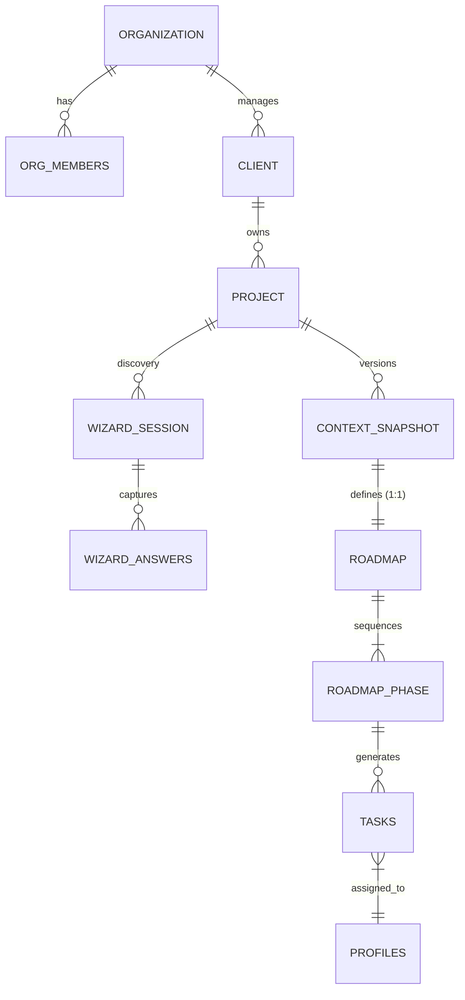

# Sun AI Agency — Production Supabase Strategy (v2.1)

This document defines the final, production-ready data architecture for the Sun AI Agency platform. It is designed for multi-tenant isolation, secure AI orchestration, and strategic auditability.

---

## 1. System Overview

Supabase serves as the secure foundation for the platform.

### Data Ownership Flow
- **Discovery (Wizard):** Raw inputs are stored as transient answers.
- **Synthesis (Edge Functions):** Only Edge Functions are permitted to write to strategic tables (`snapshots`, `roadmaps`).
- **Execution (Dashboard):** The UI reads locked strategy data and manages task status via Row Level Security (RLS).

---

## 2. Core Data Model (Schema)

Every user-facing table **must** include `org_id` to ensure absolute tenant isolation.

### 2.1 Identity & Access Control
| Table | Purpose | Key Columns |
| :--- | :--- | :--- |
| `organizations` | The high-level tenant (Agency or Enterprise). | `id`, `name`, `created_at` |
| `profiles` | Extended user metadata. | `id` (references `auth.users.id`), `full_name`, `avatar_url` |
| `org_members` | **Source of Truth for Permissions.** | `org_id`, `user_id`, `role` (`Owner`, `Consultant`, `Client`) |

### 2.2 Client & Project Hierarchy
| Table | Purpose | Key Columns |
| :--- | :--- | :--- |
| `clients` | The brands or companies being serviced. | `id`, `org_id`, `name`, `industry`, `website_url` |
| `projects` | A specific strategy or implementation track. | `id`, `org_id`, `client_id`, `name`, `status` (`Discovery`, `Active`, `Archived`) |

### 2.3 The Wizard & Discovery
| Table | Purpose | Key Columns |
| :--- | :--- | :--- |
| `wizard_sessions` | Tracks discovery progress. | `id`, `org_id`, `project_id`, `current_step` |
| `wizard_answers` | Transient storage for raw wizard inputs. | `session_id`, `screen_id`, `data` (JSONB) |

### 2.4 The Strategic Hub (Locked Data)
| Table | Purpose | Key Columns |
| :--- | :--- | :--- |
| `context_snapshots` | **Read-only** essence of the business. | `id`, `org_id`, `project_id`, `version`, `is_active` (bool), `summary`, `metrics` |
| `roadmaps` | Linked 1:1 with a snapshot. | `id`, `org_id`, `snapshot_id`, `total_duration`, `roi_projection` |
| `roadmap_phases` | Sequential execution phases. | `id`, `roadmap_id`, `title`, `order_index`, `outcomes` (JSONB) |
| `tasks` | Actionable execution units. | `id`, `org_id`, `phase_id`, `title`, `owner` (`Client`, `Sun AI`), `status` |

---

## 3. Relationships & ERD



---

## 4. Row Level Security (RLS) Strategy

Permission logic is strictly enforced via the `org_members` junction table.

### 4.1 Base Permission Logic (SQL)
Every table includes a policy that checks if the `auth.uid()` exists in `org_members` for the record's `org_id`.

```sql
-- Example: Policy for 'projects' table
CREATE POLICY "Users can only access projects in their organization"
ON public.projects
FOR ALL
USING (
  org_id IN (
    SELECT org_id FROM org_members WHERE user_id = auth.uid()
  )
);
```

### 4.2 Role-Based Permissions
- **Owners/Consultants:** Full CRUD on all organization data.
- **Clients:** SELECT access to snapshots and roadmaps; UPDATE access ONLY to task status.

---

## 5. Triggers & Versioning Logic

1. **Strategic Locking:** When a strategy is approved, an Edge Function creates a new `context_snapshot` with `is_active = true`. All previous snapshots for that `project_id` are toggled to `is_active = false`.
2. **Read-Only Enforcement:** A trigger on `context_snapshots` prevents `UPDATE` or `DELETE` if `is_active = true` (except by the service role).
3. **Auto-Tasking:** Upon `roadmap_phase` creation, a background trigger or Edge Function populates the `tasks` table.

---

## 6. Edge Functions & AI Orchestration

Only Edge Functions write to the strategy tables. UI-driven writes are restricted to `wizard_answers` and `task` status.

| Function | AI Agent | Tooling | DB Interaction |
| :--- | :--- | :--- | :--- |
| `analyze-business` | Researcher | Google Search Grounding (Targeted to website) | Write: `wizard_answers` |
| `assess-readiness` | Auditor | Gemini 3 Pro (Thinking: 4k) | Write: `readiness_assessments` |
| `generate-strategy` | Strategist | Gemini 3 Pro (Thinking: 4k) | Write: `snapshots`, `roadmaps` |
| `task-planner` | Planner | Gemini 3 Flash (Structured) | Write: `tasks` |

---

## 7. Production Readiness Checklist

### 🛡️ Security & Privacy
- [ ] Every user-facing table has RLS enabled.
- [ ] Tenant isolation verified: `org_id` present and indexed on all tables.
- [ ] Service Role Key used exclusively in Edge Functions for writing locked data.

### ⚡ Performance & Scalability
- [ ] Composite indexes on `(org_id, project_id)` for RLS performance.
- [ ] Index on `tasks.status` and `tasks.phase_id` for dashboard velocity.
- [ ] GIN index on JSONB answer columns for market trend analysis.

### 🚀 Operational Stability
- [ ] **Rate Limiting:** Implemented per `user_id` and `org_id` within Edge Functions.
- [ ] **Log Retention:** AI run logs moved to Supabase Storage after 30 days.
- [ ] **File Strategy:** `supabase_storage` bucket configured for brand assets with RLS policies mirroring the `organizations` table.
- [ ] **AI Fallback:** Standardized "Consultant Note" returned if Gemini safety filters block a response.
