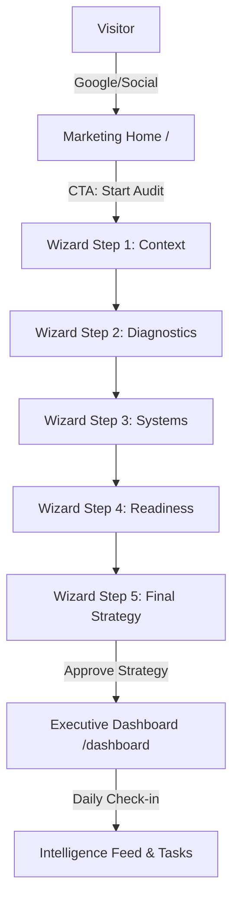

# Sun AI Agency: Sitemap & Architectural Plan

## 1. Short Summary
**Current State:** The application is currently a high-fidelity "Single Route" SPA. It uses internal React state (`step`) to manage the transition from discovery to dashboarding. 

**Main Issues & Gaps:**
- **Zero SEO:** Since everything lives on `/`, search engines cannot index the unique value propositions of the agency or specific service pages.
- **No Deep Linking:** A client cannot bookmark the "Roadmap" or "Tasks" view directly.
- **Authentication Gaps:** There is no structural boundary between the public marketing experience and the private executive data.

**Production Ready Goal:** Transition to a URL-driven architecture where `/` handles the brand narrative and `/app` (or `/dashboard`) handles the persistent strategic assets.

---

## 2. Current Sitemap (AS-IS)
The current structure is purely state-driven within a single entry point.

- `/` (Root)
    - `state: step 1` — Discovery Context
    - `state: step 2` — Industry Diagnostics
    - `state: step 3` — Architecture Mapping
    - `state: step 4` — Readiness Audit
    - `state: step 5` — 90-Day Roadmap
    - `state: step 6` — Client Dashboard Hub

---

## 3. Current Routes & Files

| Screen | Type | Status | Component File |
|:---|:---|:---|:---|
| **Discovery** | App/Wizard | Active | `Step1Context.tsx` |
| **Diagnostics** | App/Wizard | Active | `Step2Diagnostics.tsx` |
| **Architecture** | App/Wizard | Active | `Step3Systems.tsx` |
| **Readiness** | App/Wizard | Active | `Step4Readiness.tsx` |
| **Strategy** | App/Wizard | Active | `Step5Roadmap.tsx` |
| **Command Center** | App/Dashboard | Active | `ClientDashboard.tsx` |

---

## 4. Where Home & Marketing Should Live

### **Marketing Layer (`/`)**
- **Home:** High-impact "Above the Fold" value prop for Sun AI.
- **Services:** Detailed breakdown of the AI engines we build (Growth, Ops, Support).
- **CTA:** "Initialize Strategic Audit" -> Routes to the Wizard.

### **Product Layer (`/app` or `/wizard`)**
- **The Wizard:** `/wizard`. A focused, distraction-free environment for discovery.
- **The Dashboard:** `/dashboard`. The long-term executive home.

### **Real-World Scenarios**
- **Visitor from Google:** Lands on `/services/ai-content-engines`. Sees value, clicks "Audit My Content." Redirected to `/wizard?start=content`.
- **Lead clicking CTA:** From an email. Lands directly at `/wizard`.
- **Logged-in Client:** Persistent session detects their `org_id`. They bypass the wizard and land directly at `/dashboard/overview`.

---

## 5. Production-Ready Sitemap (TO-BE)

### **Public (Marketing)**
- `/` — Premium Landing Page
- `/solutions` — The "Library of AI Engines"
- `/pricing` — Enterprise vs Startup Tiering
- `/auth/login` — Executive Portal Entry

### **Private (Product)**
- `/wizard` — The 5-Step Strategic Intake
- `/dashboard` — Multi-tab Executive Command Center
    - `/dashboard/overview` — Health & North Star
    - `/dashboard/roadmap` — Phase Visualization
    - `/dashboard/tasks` — High-Velocity Actions
    - `/dashboard/systems` — Configuration Hub

---

## 6. User Journey Flow

---
*Created by Sun AI Architectural Council*
